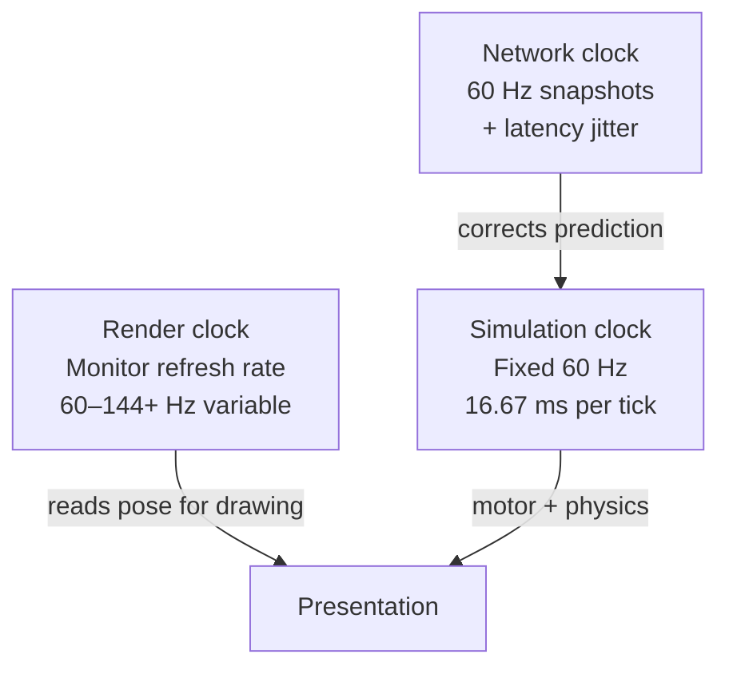
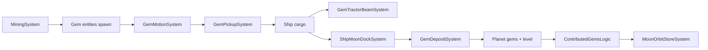

# Titan Orbit — Complete Course

**A full instructor-led curriculum for understanding every major system in the game**

| | |
|---|---|
| **Companion doc** | [`TITAN-ORBIT-MASTER-GUIDE.md`](TITAN-ORBIT-MASTER-GUIDE.md) — quick overview / map |
| **This doc** | Deep teaching — read like a textbook chapter by chapter |
| **Audience** | You know C#; Unity multiplayer and ECS are new |
| **How to study** | One volume per sitting; do exercises at end of each volume |

---

## Table of contents

### Volume 0 — How to learn this codebase
- [0.1 Why this course exists](#01-why-this-course-exists)
- [0.2 How to read code with the comments](#02-how-to-read-code-with-the-comments)
- [0.3 Study schedule (8 weeks)](#03-study-schedule-8-weeks)

### Volume 1 — Foundations before Titan Orbit
- [1.1 What kind of game this is](#11-what-kind-of-game-this-is)
- [1.2 Unity concepts you must know](#12-unity-concepts-you-must-know)
- [1.3 Multiplayer concepts in plain language](#13-multiplayer-concepts-in-plain-language)
- [1.4 ECS (Entity Component System) in plain language](#14-ecs-entity-component-system-in-plain-language)
- [1.5 Acronym reference (always spelled out)](#15-acronym-reference-always-spelled-out)

### Volume 2 — Project anatomy
- [2.1 Repository and Unity project layout](#21-repository-and-unity-project-layout)
- [2.2 Assemblies and why code is split](#22-assemblies-and-why-code-is-split)
- [2.3 Scenes, SubScenes, and prefabs](#23-scenes-subscenes-and-prefabs)
- [2.4 Third-party vs first-party code](#24-third-party-vs-first-party-code)

### Volume 3 — Boot, worlds, and session
- [3.1 The first second of the game](#31-the-first-second-of-the-game)
- [3.2 TitanOrbitBootstrap — world creation](#32-titanorbitbootstrap--world-creation)
- [3.3 ClientWorld vs ServerWorld](#33-clientworld-vs-serverworld)
- [3.4 TitanOrbitSessionManager — the real orchestrator](#34-titanorbitsessionmanager--the-real-orchestrator)
- [3.5 Go-in-game handshake](#35-go-in-game-handshake)
- [3.6 Unity Relay and Lobby](#36-unity-relay-and-lobby)
- [3.7 Dedicated server boot chain](#37-dedicated-server-boot-chain)
- [3.8 Tick rate and fixed timestep](#38-tick-rate-and-fixed-timestep)

### Volume 4 — ECS simulation core
- [4.1 Components, entities, systems, queries](#41-components-entities-systems-queries)
- [4.2 World filters and system groups](#42-world-filters-and-system-groups)
- [4.3 GameBootstrap and match singletons](#43-gamebootstrap-and-match-singletons)
- [4.4 Physics bootstrap and layers](#44-physics-bootstrap-and-layers)
- [4.5 Ship components explained field by field](#45-ship-components-explained-field-by-field)
- [4.6 Ghost authoring and baking](#46-ghost-authoring-and-baking)
- [4.7 RPCs vs ghost replication](#47-rpcs-vs-ghost-replication)

### Volume 5 — Input and local player discovery
- [5.1 From keyboard to ShipInput](#51-from-keyboard-to-shipinput)
- [5.2 ShipInputBridge and the frame-rate bridge](#52-shipinputbridge-and-the-frame-rate-bridge)
- [5.3 ClientCommandTargetSystem](#53-clientcommandtargetsystem)
- [5.4 LocalPlayerTagSystem](#54-localplayertagsystem)
- [5.5 Host input: ShipServerControlSystem](#55-host-input-shipservercontrolsystem)
- [5.6 Mobile input](#56-mobile-input)

### Volume 6 — Ship movement masterclass
- [6.1 The contract: motor vs physics](#61-the-contract-motor-vs-physics)
- [6.2 ShipMotorSimulator algorithm step by step](#62-shipmotorsimulator-algorithm-step-by-step)
- [6.3 ShipMovementBurstLogic overlays](#63-shipmovementburstlogic-overlays)
- [6.4 ShipMovementJob and Burst](#64-shipmovementjob-and-burst)
- [6.5 Server vs client movement systems](#65-server-vs-client-movement-systems)
- [6.6 Orbit ring motor](#66-orbit-ring-motor)
- [6.7 Moon dock motor interaction](#67-moon-dock-motor-interaction)
- [6.8 Shield repel overlay](#68-shield-repel-overlay)

### Volume 7 — Choppy movement: a full thesis
- [7.1 Three clocks: render, sim, network](#71-three-clocks-render-sim-network)
- [7.2 Where stepping is introduced](#72-where-stepping-is-introduced)
- [7.3 Prediction and rollback](#73-prediction-and-rollback)
- [7.4 Presentation phase discipline](#74-presentation-phase-discipline)
- [7.5 Host vs dedicated client differences](#75-host-vs-dedicated-client-differences)
- [7.6 What we refuse to do (and why)](#76-what-we-refuse-to-do-and-why)
- [7.7 Debugging movement feel](#77-debugging-movement-feel)

### Volume 8 — Hybrid presentation layer
- [8.1 Why GameObject proxies exist](#81-why-gameobject-proxies-exist)
- [8.2 ShipVisualSyncSystem and the cache](#82-shipvisualsyncsystem-and-the-cache)
- [8.3 EcsWorldVisualizer lifecycle](#83-ecsworldvisualizer-lifecycle)
- [8.4 EcsGameBridge API philosophy](#84-ecsgamebridge-api-philosophy)
- [8.5 Camera and ShipDisplayPose](#85-camera-and-shipdisplaypose)
- [8.6 Weapon mount reverse bridge](#86-weapon-mount-reverse-bridge)
- [8.7 Moon dock cinematic override](#87-moon-dock-cinematic-override)

### Volume 9 — Combat and bullets
- [9.1 Server authority for damage](#91-server-authority-for-damage)
- [9.2 BulletSimulationSystem phases](#92-bulletsimulationsystem-phases)
- [9.3 Presentation tracers and VFX](#93-presentation-tracers-and-vfx)
- [9.4 ClientLocalBulletVfxBridge](#94-clientlocalbulletvfxbridge)

### Volume 10 — Economy, planets, moons
- [10.1 Gem lifecycle](#101-gem-lifecycle)
- [10.2 Planet economy and leveling](#102-planet-economy-and-leveling)
- [10.3 Moon orbit store](#103-moon-orbit-store)
- [10.4 Capture win condition](#104-capture-win-condition)
- [10.5 People transports](#105-people-transports)

### Volume 11 — Teams, spawn, map
- [11.1 TeamManagementSystem](#111-teammanagementsystem)
- [11.2 Rejoin flow](#112-rejoin-flow)
- [11.3 Map generation algorithm](#113-map-generation-algorithm)
- [11.4 Toroidal map naming vs reality](#114-toroidal-map-naming-vs-reality)

### Volume 12 — UI and player flow
- [12.1 NceGameFlowController state machine](#121-ncegameflowcontroller-state-machine)
- [12.2 Orbit station UI](#122-orbit-station-ui)
- [12.3 HUD and minimap](#123-hud-and-minimap)

### Volume 13 — Data and content pipeline
- [13.1 ScriptableObject workflow](#131-scriptableobject-workflow)
- [13.2 Ship families and cards](#132-ship-families-and-cards)
- [13.3 Weapon config and bullet banks](#133-weapon-config-and-bullet-banks)
- [13.4 Runtime stat apply](#134-runtime-stat-apply)

### Volume 14 — Platform, build, services
- [14.1 WebGL constraints](#141-webgl-constraints)
- [14.2 Headless server builds](#142-headless-server-builds)
- [14.3 Unity Gaming Services](#143-unity-gaming-services)

### Volume 15 — Hard problems and roadmap
- [15.1 Ranked difficulty list](#151-ranked-difficulty-list)
- [15.2 Migration targets](#152-migration-targets)
- [15.3 Rules files as law](#153-rules-files-as-law)

### Volume 16 — Exercises and self-tests
- [16.1 Volume quizzes](#161-volume-quizzes)
- [16.2 Trace exercises](#162-trace-exercises)
- [16.3 Suggested experiments](#163-suggested-experiments)

### Appendices
- [Appendix A — Key file index](#appendix-a--key-file-index)
- [Appendix B — RPC catalog](#appendix-b--rpc-catalog)
- [Appendix C — System order cheat sheet](#appendix-c--system-order-cheat-sheet)

### Part II — Encyclopedia (file-by-file)
- [Chapter 17 — Every ECS/Systems file](#chapter-17--every-ecssystems-file)
- [Chapter 18 — Every Game/ bridge file](#chapter-18--every-game-bridge-file-grouped-by-role)
- [Chapter 19 — Concept essays](#chapter-19--concept-essays-read-slowly)
- [Chapter 20 — Scenario walkthroughs](#chapter-20--scenario-walkthroughs-stories)
- [Chapter 21 — ShipStatApply deep lesson](#chapter-21--shipstatapply-deep-lesson)
- [Chapter 22 — Audio, diagnostics, editor](#chapter-22--audio-diagnostics-editor-supporting-cast)
- [Chapter 23 — UI folder highlights](#chapter-23--ui-folder-highlights)
- [Chapter 24 — Shared and Simulation math](#chapter-24--shared-and-simulation-math-reference)
- [Chapter 25 — Self-test answer key](#chapter-25--self-test-answer-key-volume-16)
- [Chapter 26 — Ongoing curriculum](#chapter-26--what-to-read-next-ongoing-curriculum)
- [Chapter 27 — NetCode folder file-by-file](#chapter-27--netcode-folder-file-by-file)
- [Chapter 28 — Movement case studies](#chapter-28--movement-case-studies-extended)

---

# Volume 0 — How to learn this codebase

## 0.1 Why this course exists

You asked for more than a map of the project — you asked to be **taught**. That is a different goal. A map tells you *where* things are. A course tells you *how to think* when you open a file, *why* a design choice was made, and *what breaks* when you change it.

Titan Orbit is not a small indie prototype. It is a **Unity DOTS (Data-Oriented Technology Stack) multiplayer game** using **NetCode for Entities (NCE)** — meaning the simulation runs in an **ECS (Entity Component System)** world, networked entities are called **ghosts**, and your ship's visuals are still **GameObjects** because art pipelines demand it. That hybrid stack is powerful but easy to misunderstand. The most common misunderstanding — and the one that causes the most pain — is thinking the **mesh you see** is what moves the ship. It is not. The **ECS entity's physics and transform** move the ship. The mesh follows.

This course is long on purpose. Short docs optimize for scanning. Learning optimizes for **repetition, analogy, and progression**. We will go from "what is a World?" to "why does fixed timestep plus prediction plus presentation produce stepped motion unless every reader agrees on phase." You can read the companion [`TITAN-ORBIT-MASTER-GUIDE.md`](TITAN-ORBIT-MASTER-GUIDE.md) first for a glimpse; return here when you want to actually understand.

**How I will teach you:** Every major topic gets (1) a plain-language analogy, (2) the real technical mechanism, (3) the exact files involved, (4) pitfalls students hit, and (5) how it connects to the next topic. When I use an acronym, I spell it out the first time in that section.

## 0.2 How to read code with the comments

We added **educational comments** across the codebase. They are not decoration — they are part of the curriculum. Comments use tags:

| Tag | Meaning |
|-----|---------|
| `[STANDARD]` | Normal software pattern |
| `[UNITY]` | Unity engine behavior |
| `[ECS/DOTS]` | Entities, components, systems |
| `[NETCODE]` | Ghosts, prediction, RPCs |
| `[PHYSICS]` | Unity Physics package |
| `[TITAN-ORBIT]` | Custom game design choice |
| `[HYBRID]` | ECS sim ↔ GameObject presentation bridge |

When you open a file, read the **file summary** at the top first. It tells you which world (client/server) the code runs in and which paired file to open next. Then read method summaries before the body. The body has `// --- Section ---` headers — skim those to navigate.

**Student habit:** Keep this course doc open in one pane and the `.cs` file in another. When the course names a file, open it and read the comments there too. The course explains *concepts*; the code comments explain *this line in this project*.

## 0.3 Study schedule (8 weeks)

| Week | Volumes | Outcome |
|------|---------|---------|
| 1 | 0–2 | You can navigate the repo and explain assemblies |
| 2 | 3–4 | You understand worlds, boot, ECS basics |
| 3 | 5–6 | You can trace input → motor → physics |
| 4 | 7 | You understand choppy movement deeply |
| 5 | 8 | You understand hybrid presentation |
| 6 | 9–11 | Combat, economy, teams, map |
| 7 | 12–14 | UI, data, build, WebGL |
| 8 | 15–16 + exercises | You can debug without me |

**Daily habit (45–90 min):** Read one section, open cited files, answer the section's check questions (end of volumes), optionally run Editor Play Mode and watch the behavior described.

---

# Volume 1 — Foundations before Titan Orbit

## 1.1 What kind of game this is

Titan Orbit is a **team-based top-down space action game** played online. You fly a ship, shoot enemies, mine gems from asteroids, deposit gems on friendly moons orbiting planets, upgrade your ship through a card/loadout station, capture planets, and eventually eliminate other teams by owning the entire map.

The design loop is intentionally **arcade-fast** (responsive thrust, frequent combat) layered on **strategy** (planet ownership, economy, team coordination). That combination is why networking is hard: players expect **instant** ship response, but the server must be **fair** — only one machine can decide who died.

So the architecture optimizes for:

1. **Responsive local control** — client prediction on your ship
2. **Authoritative outcomes** — server bullets and damage
3. **Rich visuals** — prefab ships, particles, UI
4. **Browser play** — WebGL client + cloud headless server

None of those four goals is optional. The code is organized around reconciling them.

## 1.2 Unity concepts you must know

**MonoBehaviour** — A C# class that Unity attaches to GameObjects. It gets `Update()`, `Start()`, etc. Most UI, camera, and input in Titan Orbit is still MonoBehaviour because it is easy and familiar.

**GameObject** — A scene object with components. Your ship *visual* is a GameObject hierarchy (meshes, particles). It is a **render shell**.

**ScriptableObject (SO)** — A data asset file (`.asset`) holding design numbers: ship stats, card definitions, map settings. Edited in Inspector, loaded at runtime. Lives in `Assets/Scripts/Data/`.

**Scene** — A level file. Titan Orbit builds with one main scene: `SampleScene.unity`.

**SubScene** — An ECS baking chunk (`GameplaySubScene.unity`). Ghost prefabs bake here into entities.

**Prefab** — Reusable template. Ship families, planets, and `StarshipGhost` are prefabs.

**Fixed timestep** — Simulation advances in fixed slices (1/60 second), not every render frame. Critical for networked games.

**Assembly (.asmdef)** — Compilation unit. Titan Orbit splits code into ~14 assemblies so dependencies stay clean.

If any of these still feel abstract, revisit them when we hit the matching volume — repetition is intentional.

## 1.3 Multiplayer concepts in plain language

**Client** — The program on the player's machine that draws the game and reads input.

**Server** — The program that runs authoritative simulation. In Titan Orbit, even "host" runs a server world locally.

**Dedicated server** — A server build with **no graphics and no local player** — only simulation and networking. Runs on Google Cloud for production matches.

**Latency** — Delay between your input and the server seeing it. Measured in milliseconds.

**Prediction (client-side prediction)** — Your client **simulates your ship immediately** using the same motor code as the server, so you do not wait for the network round trip to feel thrust. When the server disagrees, the client **rolls back** and corrects.

**Interpolation** — For **other players'** ships, your client smoothly blends between past snapshots because you do not predict them.

**Replication** — Sending component state over the network (position, health, team).

**RPC (Remote Procedure Call)** — A one-shot message: "I want team B", "buy this upgrade". Server validates before acting.

**Authority** — Who is allowed to decide truth. Server is authoritative for damage, gems deposited, planet ownership. Client is authoritative only for **feel** on your ship via prediction — and even that must converge to server truth.

**Analogy — restaurant kitchen:** You (client) start plating food when you *think* the order is ready (prediction). The head chef (server) sends the ticket back if you were wrong (rollback). Other tables' plates (remote players) you only see when the pass window updates (interpolation). The menu prices (RPCs) require chef approval.

## 1.4 ECS (Entity Component System) in plain language

Old Unity style: one big `Ship.cs` MonoBehaviour with health, speed, mesh, input mixed together.

ECS style: a ship is an **entity** (an ID) with **components** (small data structs):

- `ShipState` — health, team, gems
- `LocalTransform` — position, rotation
- `PhysicsVelocity` — linear velocity for physics
- `ShipInput` — what the player wants this tick

**Systems** are functions that run every tick: "for every entity with `ShipTag` and `ShipInput`, run motor."

**Why ECS for Titan Orbit?** Many ships, bullets, gems, planets — ECS + Burst jobs scale better than thousands of MonoBehaviours. NetCode for Entities is built on ECS.

**What ECS is NOT in this project:** It is not the rendering layer. We do not draw ships with Entities Graphics. We use **hybrid** proxies (Volume 8).

## 1.5 Acronym reference (always spelled out)

See the master guide glossary for the full table. In this course, the first use in each volume spells out:

- **ECS** — Entity Component System
- **DOTS** — Data-Oriented Technology Stack (Unity's ECS + Jobs + Burst bundle)
- **NCE / NetCode** — NetCode for Entities
- **RPC** — Remote Procedure Call
- **SO** — ScriptableObject
- **UGS** — Unity Gaming Services (Relay, Lobby, Auth)
- **URP** — Universal Render Pipeline
- **WebGL** — Web Graphics Library (browser builds)
- **Burst** — Unity Burst Compiler (fast native code from C# jobs)
- **MPPM** — Multiplayer Play Mode (multi-editor testing)
- **HUD** — Heads-Up Display
- **VFX** — Visual Effects
- **GCE** — Google Compute Engine

---

# Volume 2 — Project anatomy

## 2.1 Repository and Unity project layout

The git repo root is `Titan-Orbit/`. The Unity editor project lives in `Titan Orbit/` (note the space). Day-to-day code is under `Titan Orbit/Assets/Scripts/`.

```
Titan-Orbit/
├── .cursor/rules/           ← Architecture law (ship sim, comments, rebuild)
├── tools/gce/               ← Deploy scripts for Linux server
└── Titan Orbit/             ← Open THIS folder in Unity Hub
    ├── Assets/
    │   ├── Scripts/         ← All first-party C#
    │   ├── Scenes/
    │   ├── Prefabs/
    │   ├── Data/            ← ScriptableObject instances
    │   ├── Editor/Build/
    │   └── Resources/
    ├── Docs/                ← You are here
    └── BuildOutput/         ← After builds
```

**Teaching point:** `.cursor/rules/` is not runtime code — it is **documentation we enforce in development**. When an AI agent or you edit sim code, those rules say what is forbidden (e.g. no extra proxy lerp on local owner). Treat them like a textbook supplement.

## 2.2 Assemblies and why code is split

**File pattern:** `Assets/Scripts/<Area>/<Name>.asmdef`

Assemblies prevent "UI accidentally references server-only code" and keep compile times manageable.

**Dependency direction (simplified):**

```
Shared → Data → Simulation → ECS → NetCode
                              ↘
Core, Input, Entities → Game → UI
Services → Game
```

| Assembly | You open it when… |
|----------|-------------------|
| `TitanOrbit.Simulation` | Learning motor math, planet formulas — **no Unity scene** |
| `TitanOrbit.ECS` | Learning systems, components, combat, economy |
| `TitanOrbit.NetCode` | Learning connect, Relay, bootstrap |
| `TitanOrbit.Game` | Learning proxies, bridges, flow UI |
| `TitanOrbit.Data` | Learning designer assets |
| `TitanOrbit.UI` | Learning orbit station, minimap |

**Student mistake:** Putting GameObject code inside `TitanOrbit.ECS`. ECS assembly should not depend on UI. Bridges live in `Game`.

## 2.3 Scenes, SubScenes, and prefabs

**`SampleScene.unity`** — The only scene in the player build. Contains menu roots, camera, `NceGameFlowController`, session manager hooks.

**`GameplaySubScene.unity`** — ECS subscene with baked ghosts (ships, planets, registry). Loaded as part of netcode setup (`NetCodeGameSetup` editor menu).

**Ghost prefabs** (`Assets/Prefabs/ECS/`) — `StarshipGhost`, `PlanetGhost`, etc. Each has:

- `GhostAuthoringComponent` (NetCode replication config)
- `*GhostAuthoring` MonoBehaviour (baker writes ECS components)

**Baking** converts GameObject authoring data into **entity component data** at build/load time. When you change a ghost prefab field, you may need to **rebake** the subscene.

## 2.4 Third-party vs first-party code

| Area | Examples | Touch for learning? |
|------|----------|---------------------|
| First-party | `Assets/Scripts/**` | **Yes — primary** |
| Shapes | Vector HUD drawing | Use, rarely modify |
| Shift Sci-Fi UI | Menu widgets | Skin only |
| Space Graphics Toolkit | Planets/nebula | Visuals |
| Ultimate Spaceship Creator | Ship meshes | Art source |

When debugging movement, **do not start in Plugins/**. Start in `ECS/Systems/ShipMovementLogic.cs` and `Game/EcsWorldVisualizer.cs`.

---

# Volume 3 — Boot, worlds, and session

## 3.1 The first second of the game

When Unity launches `SampleScene`, several things race to initialize. Order matters.

1. **Unity engine** loads scene objects (MonoBehaviours `Awake`/`Start`).
2. **NetCode bootstrap** (`TitanOrbitBootstrap.Initialize`) creates `ClientWorld` and/or `ServerWorld`.
3. **`TitanOrbitSessionManager`** becomes singleton (`DontDestroyOnLoad`).
4. **`NceGameFlowController`** shows main menu.
5. On server: **`GameBootstrapSystem.OnCreate`** creates match singletons.
6. On dedicated: **`TitanOrbitDedicatedServerBootRunner`** ensures boot starts.

You, the player, only see the menu. Underneath, an entire invisible ECS universe may already exist — suspended in editor until you click Local Play.

**Check question:** Why does the editor suspend server simulation at menu? *Answer in §3.4.*

## 3.2 TitanOrbitBootstrap — world creation

**File:** `Assets/Scripts/NetCode/TitanOrbitBootstrap.cs`

This class extends NetCode's `ClientServerBootstrap`. Its `Initialize` method is the **branching router** for which ECS worlds exist.

**Always runs:**

- `Application.runInBackground = true` — sim keeps going when window unfocused (important for host testing).
- On `UNITY_SERVER` builds: `Application.targetFrameRate = 60` — aligns with 60 Hz sim.
- Sets `NetworkStreamReceiveSystem.DriverConstructor = new TitanOrbitRelayDriverConstructor()` — all network drivers go through Relay-aware factory.
- Sets `AutoConnectPort`:
  - Editor: **0** (do not auto-listen; menu chooses LAN/Relay)
  - Player build: **7777** unless dedicated
  - Dedicated: **0** (Relay binds later in session manager)

**Editor branches:**

| Condition | Worlds |
|-----------|--------|
| CLI `--titanOrbitDedicated` | Server only |
| MPPM clone (`--virtual-project-clone`) | Client only |
| Default | Client + Server |

**Player build branches:**

| Condition | Worlds |
|-----------|--------|
| `UNITY_SERVER` or dedicated CLI | Server only |
| `PendingLanHost` flag | Client + Server |
| Default | Client + Server |

**Teaching analogy:** Bootstrap is the **building architect**. It decides how many simulation "floors" exist (client floor, server floor) before anyone moves furniture in (spawns ships).

## 3.3 ClientWorld vs ServerWorld

A **World** in DOTS is a container: entities, components, systems. NetCode typically gives you:

- **ClientWorld** — runs prediction, presentation, client RPC send/receive
- **ServerWorld** — runs authoritative sim for all connected players

They are **not** the same data. They are two parallel simulations kept in sync by networking.

| | ClientWorld | ServerWorld |
|---|-------------|-------------|
| Your ship | Predicted locally | Authoritative |
| Enemy ship | Interpolated from snapshots | Simulated |
| Bullets damaging | Cosmetic tracers | Real hit detection |
| Runs on dedicated client? | Yes | No (or suspended) |
| Runs on dedicated server? | No | Yes |

**Local host twist:** Both worlds run on one PC. Your client predicts; your server authoritative copy must agree often because latency is ~0. Visualization code often reads **ServerWorld** on host (`EcsGameBridge.GetVisualizationWorld`) while input prediction uses **ClientWorld**.

## 3.4 TitanOrbitSessionManager — the real orchestrator

**File:** `Assets/Scripts/NetCode/TitanOrbitSessionManager.cs` (~1800 lines)

If `GameManager` is a small debug helper, **`TitanOrbitSessionManager` is the multiplayer brain**. It is a MonoBehaviour singleton surviving scene loads.

**Responsibilities:**

- Start local LAN host / client (editor dev)
- Join dedicated match via UGS Lobby + Relay
- Boot headless server (Relay allocation, lobby publish, listen)
- Track `IsInGame`, `IsDedicatedOnlineClient`, status messages for UI
- Send team/rejoin RPC helpers
- **`TickServerWorld()` on `UNITY_SERVER`** — manual ECS pump

### Editor menu idle behavior

`SuspendEditorLocalServerUntilLocalPlay()` disables `SimulationSystemGroup` on ServerWorld while at main menu. **Why?** Map generation could finish before you click Play, leaving you a stale world. Students see "map already loaded" bugs if this is removed.

When you click **Local Play**, `ResumeEditorLocalServerForLocalPlay()` re-enables sim and runs `BootLanHost()`.

### LAN host flow (`StartLocalPlay`)

1. Prepare worlds (clear stale connections, relay state)
2. Server listens on port 7777 (loopback)
3. Client connects to `127.0.0.1:7777`
4. Manual `RequestGoInGame` on both sides (LAN shortcut — no RPC handshake)

### Dedicated join flow (`JoinDedicatedLobbyAsync`)

1. UGS guest authentication
2. Leave old lobbies (stale relay codes are a real bug class)
3. Join lobby by id → read member-only `RelayJoinCode`
4. `JoinAllocationAsync` → `TitanOrbitRelayState.SetClientRelay`
5. Reset client driver, connect via Relay
6. `ClientConnectWatch` waits for `NetworkStreamInGame` + valid `NetworkId`
7. **Go-in-game RPC** (not manual) via `TitanOrbitGoInGameClientSystem`

### TickServerWorld — why headless needs it

```csharp
// Simplified concept from TitanOrbitSessionManager
static void TickServerWorld(World world) {
    if (Time.frameCount == s_LastServerTickFrame) return; // once per Unity frame
    s_LastServerTickFrame = Time.frameCount;
    world.Update();
}
```

Headless Linux builds do not behave like the editor player loop. Without `world.Update()`, **Relay packets stall**, clients connect but never get `NetworkId` — "zombie connection." This is production-critical, not optimization.

**Check question answer:** Editor suspends server sim so map/match does not advance while you are still in menu.

## 3.5 Go-in-game handshake

**File:** `Assets/Scripts/NetCode/TitanOrbitGoInGameSystems.cs`

NetCode uses `NetworkStreamInGame` component on connection entities to mean: **ready for ghost replication**.

**Dedicated clients:**

1. `TitanOrbitGoInGameClientSystem` sees connection with `NetworkId` but not `InGame`
2. Adds `NetworkStreamInGame` locally and sends `GoInGameRequest` RPC
3. `TitanOrbitGoInGameServerSystem` receives RPC, adds `NetworkStreamInGame` on server connection

**LAN local play:** Session manager calls `RequestGoInGame` directly — skips RPC.

**Student mistake:** Connecting to Relay but never reaching in-game → no ships spawn. Debug `NetworkStreamInGame` on connection entity.

## 3.6 Unity Relay and Lobby

### Relay (packet routing)

Players rarely have public IPs suitable for hosting. **Unity Relay (UTP — Unity Transport Protocol)** routes encrypted packets through Unity's servers.

**Files:**

- `TitanOrbitRelayUtility.cs` — allocation → `RelayServerData`, timeouts, `wss` vs `dtls`
- `TitanOrbitRelayDriverConstructor.cs` — creates drivers with relay parameters
- `TitanOrbitRelayState` — static slot holding current relay config

**Server dedicated:** Relay UDP only on headless (no IPC) — comment notes IPC + Relay caused missed remote connections.

**WebGL clients:** Often need `wss` (WebSocket secure) path.

### Lobby (match browser metadata)

**File:** `TitanOrbitLobbyService.cs`

UGS Lobby stores:

| Key | Purpose |
|-----|---------|
| `RelayJoinCode` | How clients join relay (member-visible) |
| `IsOpen` | Accepting players |
| `IsLatest` | Quick-join target |
| `ServerAliveAt` | Heartbeat — stale lobbies rejected |
| `GameName` | Filter `TitanOrbit` |

Server boot creates lobby after listen succeeds. Heartbeat updates while match runs. Join browser queries joinable lobbies.

**Teaching analogy:** Lobby is the **match listing on a website**. Relay is the **phone line** once you join.

## 3.7 Dedicated server boot chain

Sequence on Google Cloud:

```
TitanOrbitBootstrap → ServerWorld only, port 0
TitanOrbitDedicatedServerBootRunner.AfterSceneLoad
  → create session manager if missing
  → EnsureDedicatedBootStarted()
BootDedicatedServer coroutine:
  → wait for NetworkStreamDriver
  → Relay CreateAllocation + join code
  → ListenServer (AnyIpv4 for relay)
  → GoInGame on server connections
  → Create UGS Lobby (IsLatest, IsOpen, heartbeat)
TitanOrbitSessionManager.Update → TickServerWorld every frame
TitanOrbitDedicatedServerHost → match rotation (20 min / full lobby)
```

See `Docs/server-hosting-24_7.md` for systemd unit example.

## 3.8 Tick rate and fixed timestep

**File:** `TitanOrbitServerTickRateSystem.cs`

Server sets singleton `ClientServerTickRate`:

- SimulationTickRate = **60**
- NetworkTickRate = **60**
- MaxSimulationStepsPerFrame = **4**

**Critical teaching point:** Ship speed is in **units per second**. 60 Hz does not make ships faster — it means **60 small steps per second**. If your monitor renders 144 FPS, most frames either do zero sim steps or occasionally do 2–4 catch-up steps after a hitch.

This is a **major source of perceived stepping** (Volume 7).

`TitanOrbitClientTickRateSystem` is intentionally empty today — clients inherit server rate on connect.

---

# Volume 4 — ECS simulation core

## 4.1 Components, entities, systems, queries

**Entity** — Integer ID. No behavior attached to the ID itself.

**Component** — `struct` implementing `IComponentData` (or buffer interfaces). Plain data.

Example: `ShipState` holds `Health`, `Team`, `CurrentGems`, `IsDead`.

**System** — Code that iterates matching entities each tick.

Example: `ShipMovementSystem` runs `ShipMovementJob` over entities with `ShipTag` + `Simulate`.

**Query** — Filter defining which entities a system sees:

```csharp
// Conceptual
foreach (ship with ShipTag + Simulate + ShipMotorConfig) { ... }
```

**Student skill:** When you open any `*System.cs`, find:

1. `[WorldSystemFilter]` — client, server, or both?
2. `[UpdateInGroup]` / `[UpdateBefore]` — when in frame?
3. `.WithAll` / `.WithNone` — who is in the query?

## 4.2 World filters and system groups

**WorldSystemFilterFlags:**

- `ClientSimulation` — owner prediction, input apply, client RPC receivers
- `ServerSimulation` — damage, spawning, economy
- Combined — shared setup (physics bootstrap, presentation cache)

**Major groups (simplified frame):**

```
InitializationSystemGroup     ← once: physics gravity, tick rate, match singletons
GhostInputSystemGroup         ← client input onto ghosts
PredictedFixedStepSimulationSystemGroup
  └── ShipMovement*           ← BEFORE physics
PhysicsSystemGroup            ← integrates position, collisions
SimulationSystemGroup         ← bullets, gems, teams, capture
PresentationSystemGroup       ← interpolation, ShipVisualSyncSystem last
```

**Why order is law:** Motor sets velocity **before** physics integrates position. Bullets read positions **after** movement. Breaking `[UpdateBefore(typeof(PhysicsSystemGroup))]` on movement causes one-frame lag bugs.

## 4.3 GameBootstrap and match singletons

**File:** `ECS/Systems/GameBootstrapSystem.cs`

**`GameBootstrapSystem.OnCreate` (server):** Creates one entity holding:

| Singleton / buffer | Role |
|--------------------|------|
| `TeamStateSingleton` | Per-team player counts, elimination |
| `MatchStateSingleton` | Timer, win team, game state byte |
| `MapStateSingleton` | Width, height, seed, loading progress |
| `BulletElement` buffer | Active bullets (server sim list) |
| `BulletSpawnEventElement` | Cosmetic spawn events for presentation |
| `BulletHitEventElement` | Hit events for impact VFX |
| `MapLayoutEntryElement` | Minimap / spawn layout |
| `PlayerNameElement` | Scoreboard names |

**`MapGenerationSystem`:** Phased procedural spawn — one entity per tick from queue until done, updates `LoadingComplete`.

**`MatchTimerSystem`:** Increments match timer after first tick.

**Teaching point:** Singletons are "global variables done right in ECS" — one entity, one component, queried everywhere.

## 4.4 Physics bootstrap and layers

**File:** `ECS/Systems/TitanOrbitPhysicsBootstrapSystem.cs`

On both client and server:

- Sets **gravity to zero** (top-down space)
- Creates **`LagCompensationConfig`** with history size 16 — enables prediction rewind for physics

**File:** `ECS/TitanOrbitPhysicsLayers.cs`

| Layer | Who | Collides with |
|-------|-----|---------------|
| Ship | Dynamic sphere | Ships, WorldStatic |
| WorldStatic | Planets, asteroids | Ships, gems, transports |
| Gem | Gems (scripted motion) | World only |
| Transport | People transports | World only |

Ships **do not** physics-collide with gems — pickup is distance-based in `GemPickupSystem`.

**Baked on ship:** `InverseInertia = 0` — contacts won't spin hull. Rotation comes from motor only.

## 4.5 Ship components explained field by field

### `ShipInput` (`ECS/Components/ShipInput.cs`)

NetCode **input component** — sent from owner client to server each tick.

| Field | Meaning |
|-------|---------|
| `AimPlanarDir` | Normalized XZ aim (mouse direction) |
| `Thrust` | Hold forward thrust |
| `Fire` | `InputEvent` — fire pressed this tick |
| `SpaceBrakes` | Brake toggle |
| `WantDepositGems` | Deposit while docked |

### `ShipState`

| Field | Meaning |
|-------|---------|
| `Health` / `MaxHealth` | Hull |
| `Team` | `TeamId` — `None` until team pick |
| `ShipLevel` | Upgrade tier |
| `CurrentGems` / `GemCapacity` | Cargo |
| `CurrentEnergy` / `MaxEnergy` | Weapon fuel |
| `IsDead` | Awaiting respawn |
| `AwaitingTeamSelection` | Spawn gate |

Ghost-replicated — other players' HUD/minimap can read your team and rough state.

### `ShipMotorConfig` (not ghost — recomputed)

`EngineThrust`, `MaxSpeed`, `RotationSpeed`, `BrakeDeceleration`, mass references — from chassis + loadout via `ShipStatApplySystem`.

### `ShipMoonDockState`

`MoonPlanetId`, `LandingProgress`, approach delay — server `ShipMoonDockSystem` writes; motor reads to pin ship when landed.

### `ShipDepositIntent`

Separate from input — survives prediction rollback. Server sets via `SetWantDepositGemsCommand` RPC.

## 4.6 Ghost authoring and baking

**File:** `ECS/Authoring/StarshipGhostAuthoring.cs`

Designer places MonoBehaviour on prefab → **Baker** runs at bake time:

**Components stamped:**

- Tags: `ShipTag`
- State: `ShipState` defaults (100 HP, awaiting team)
- Motor/weapon/vitals configs
- `ShipInput`, `ShipKinematics`
- Orbit/dock/deposit defaults

**Buffers:**

- `ShipWeaponMountElement` — from child `ShipWeaponMountAuthoring` or "Weapon" transforms
- `ShipWingTractorBeamElement` — wing gem tractor positions

**Physics body:**

- Sphere collider, dynamic mass, restitution 0.5, friction 0.05
- `PhysicsGravityFactor = 0`
- `PhysicsMassOverride` for kinematic moon dock

**Teaching analogy:** Baking is a **factory stamp** — the prefab is the blueprint; the subscene holds the stamped ECS entities ready for runtime instantiation.

## 4.7 RPCs vs ghost replication

**Ghosts** continuously replicate component fields (health, transform, team). Good for **state that changes every tick or often**.

**RPCs** are discrete messages. Good for **actions with validation**:

- Pick team (can't pick twice)
- Buy upgrade (server checks gems)
- Rejoin choice

**File:** `ECS/Components/NetworkCommands.cs` — full catalog in Appendix B.

**Rule of thumb:** If cheating would matter and it's not already on a server-only system, use RPC + server validation.

---

# Volume 5 — Input and local player discovery

## 5.1 From keyboard to ShipInput

Input is the **first domino** in the movement pipeline. If you misunderstand input timing, everything downstream looks "laggy" or "stepped" even when motor and physics are correct.

**Files involved:**

| Layer | File |
|-------|------|
| Device reading | `Input/PlayerInputHandler.cs`, `Input/MobileInputHandler.cs` |
| Bridge | `Game/ShipInputBridge.cs` |
| Staging | `ECS/Components/ShipPendingInput.cs` (static latest) |
| Apply | `ECS/Systems/ShipInputApplySystem.cs` |
| Component | `ECS/Components/ShipInput.cs` |

`PlayerInputHandler` uses Unity's **New Input System** (`InputSystem_Actions.inputactions`) with keyboard/mouse fallbacks. It answers questions like: is W held, is left mouse down, where is the mouse on the XZ plane?

None of this touches ECS directly. That separation is intentional — MonoBehaviour `Update` runs at **render rate** (variable: 60–144+ FPS). ECS sim runs at **fixed 60 Hz**. Mixing them without a buffer causes input to be missed or doubled.

`ShipInputBridge` (execution order **-10000**, very early in the frame) reads handlers and builds a `ShipInput` struct:

- **AimPlanarDir** — from mouse world position minus ship position, or mobile drag direction
- **Thrust** — forward thrust held
- **Fire** — `InputEvent` one-shot when shoot pressed (NetCode pattern for "pressed this tick")
- **SpaceBrakes** — from Ctrl toggle
- **WantDepositGems** — from moon orbit client state

It writes to `ShipPendingInput.Set(...)`.

**Teaching moment:** Notice `Fire` uses `InputEvent`. Buttons that should fire once per press in networked games must not be a bool "is held" on the sim boundary — otherwise prediction resim might shoot twice or zero times. NetCode's input events are designed for this.

## 5.2 ShipInputBridge and the frame-rate bridge

Why not write `ShipInput` directly in `ShipInputBridge`?

Because **`ShipInputApplySystem` runs in `GhostInputSystemGroup`**, tied to the **client simulation tick**, not `Update`. The pending buffer is the **mailbox** between render frames and sim ticks.

**Scenario:** Monitor 144 FPS, sim 60 Hz.

- Some render frames: two Updates, zero sim steps → pending holds latest intent
- Some frames: zero Updates, one sim step → apply reads last pending (good)
- Hitch frame: four sim catch-up steps → apply may run four times; input should be consistent per step

**Pitfall:** If `ShipInputBridge` is disabled or `PlayerInputHandler` missing, pending never updates — ship drifts with zero thrust but no error spam. Always verify input chain when movement "does nothing."

**Orbit menu guard:** Fire is blocked when moon orbit menu visible — UX choice so you don't shoot while shopping.

## 5.3 ClientCommandTargetSystem

**File:** `ECS/Systems/ClientCommandTargetSystem.cs`  
**World:** Client only  
**Group:** `GhostInputSystemGroup`, **OrderFirst**

When you join a dedicated server, this sequence happens:

1. You connect (connection entity exists)
2. You pick a team (RPC)
3. Server spawns your ship with `GhostOwner.NetworkId`
4. Client must attach input commands to **that** ship entity

NetCode uses `CommandTarget` component on the connection: `targetEntity = your ship`.

This system:

1. Skips if local host (server uses `ShipServerControlSystem` instead) or team UI suppresses control
2. Finds local `NetworkId` from in-game connection
3. Queries ship with matching `GhostOwner`
4. Sets `CommandTarget.targetEntity`

**Analogy:** At an arcade, you swipe your card (connection), choose a game (team RPC), get assigned machine #3 (spawn), then the cab routes the joystick to machine #3 (`CommandTarget`). Without step 4, you'd be pressing buttons with no effect.

## 5.4 LocalPlayerTagSystem

**File:** `ECS/Systems/LocalPlayerTagSystem.cs`

Adds **`LocalPlayerShipTag`** to your ship for fast queries — camera, HUD, visualizer, input fallbacks.

Resolution paths (in order of strategy):

1. `CommandTarget` on connection → target entity
2. `GhostOwner.NetworkId` match
3. `GhostOwnerIsLocal` enableable flag (NetCode fallback)

Uses `EntityCommandBuffer` for structural changes (add/remove tag).

**Why a tag instead of querying `GhostOwnerIsLocal` everywhere?** Historical hybrid paths and host edge cases — multiple ways to identify "my ship" after team spawn timing. `EcsGameBridge` duplicates similar fallback chains for transforms.

**UI suppression:** `ClientTeamFlowState.ShouldSuppressLocalPlayerControl()` blocks tagging during team pick / rejoin — prevents you flying a ship before design allows.

## 5.5 Host input: ShipServerControlSystem

**File:** `Game/ShipServerControlSystem.cs`

On **local host**, the server world cannot rely on NetCode command round-trip for the host player's ship — latency is zero but worlds are separate.

This system (server world, after `GhostInputSystemGroup`, before movement) reads keyboard/mouse similarly to `PlayerInputHandler` and writes **`ShipInput` directly on the server ghost**.

Meanwhile client world still runs:

`ShipInputBridge` → `ShipInputApplySystem` → **prediction**

So host uses **dual input paths** converging on the same motor math in different worlds. They should match closely. If they diverge, host feels "weird" compared to dedicated client.

## 5.6 Mobile input

**File:** `Input/MobileInputHandler.cs`

Touch model:

- **Left half:** anchor steering — drag sets aim; drag distance > threshold enables thrust
- **Right half:** hold to shoot
- Exclusion rects prevent shooting through UI buttons

`PlayerInputHandler` delegates when `TouchUiActive`.

**Cosmetic smoothing:** `MobileSteerVisualUI` may smooth stick display — **allowed** per architecture rules (UI only, not hull sim).

**CrossPlatformManager** sets mobile 30 FPS vs desktop 60 — affects render, not sim Hz. Mobile can feel different because of frame pacing, not because motor changed.

---

# Volume 6 — Ship movement masterclass

This volume is the technical heart of the game. Read it twice.

## 6.1 The contract: motor vs physics

**Motor** (`ShipMotorSimulator` + `ShipMovementBurstLogic`):

- Reads `ShipInput`, planet context, dock state
- Writes **`PhysicsVelocity.Linear`**
- Writes **`LocalTransform.Rotation`**
- Writes **`ShipKinematics.Velocity`** mirror
- Does **NOT** write **`LocalTransform.Position`**

**Unity Physics** (`PhysicsSystemGroup`):

- Integrates **position** from velocity
- Resolves sphere collisions (ships, planets, asteroids)
- May alter velocity on bounce (restitution)

**Why split?** Collisions must be consistent and shared with Unity's solver. If motor manually integrated position *and* physics ran, you'd double-move or fight the solver.

**Student experiment (mental):** Imagine motor teleports position when hitting a planet. Physics also pushes back. Ship vibrates or tunnels. Centralizing position in physics avoids that war.

## 6.2 ShipMotorSimulator algorithm step by step

**File:** `Simulation/ShipMotorSimulator.cs`

`Step(ref state, in p, aimWorldXZ, thrust, spaceBrakes, integratePosition)`:

### Step 0 — Guard dt

If `dt <= 0`, return. Protects against bad clock.

### Step 1 — Electric shock (if enabled)

Hard brake, no rotation/thrust. Status effect path.

### Step 2 — Rotate toward aim

`TryRotateTowardAim`:

- Aim point on XZ plane from `aimWorldXZ`
- `LookRotationSafe` toward aim
- Clamp turn by `rotationSpeedDeg × dt` using slerp fraction

**Teaching:** Rotation is **frame-rate independent** because turn cap scales with `dt`.

### Step 3 — Velocity

**Orbit branch** if `p.UseOrbit`:

```
blended = lerp(currentVel, OrbitDesiredVelocity, saturate(OrbitAlignRate × dt))
```

**Thrust branch** else `ApplyThrustAndBrakes`:

- Thrust along ship forward `(0,0,1)` rotated
- Acceleration `EngineThrust / mass` (F = ma)
- Below max speed: add accel along forward
- At/above max speed: thrust **perpendicular component** only (steer without speeding up — strafe cap behavior)
- Space brakes: decelerate along velocity when not thrusting
- Recoil decay: if `|v| > MaxSpeed`, bleed excess at `RecoilDecayPerSecond / mass`

### Step 4 — Position integration

Only if `integratePosition == true`. **Ships pass false.**

---

**Mass** comes from `ShipMassLogic.ComputeMovementMass` — heavier (more HP, more **current** gems and people) → slower acceleration via F/m. Mass alone does **not** lower MaxSpeed or turn.

**Capacity tax** (empty-hold identity) lives in `ShipMobilityResolution` + `ShipCargoMobilitySettings`: summed component `maxGems` / `maxPeople` automatically scale MaxSpeed, EngineThrust, and RotationSpeed before they land in `ShipMotorConfig`. People hit top speed harder; gems hit accel harder; turn has separate gem/people weights (same defaults for now). A freighter with a huge people hold is slow even when empty.

**Current-load tax** uses the same MaxSpeed/turn weights on `CurrentGems` / `CurrentPeople` each motor tick (and on the speedometer). Accel when collecting still comes mainly from movement mass (F/m).

**Per-level mobility drag** is also on that settings asset: `levelMaxSpeedPenaltyFractionPerLevel` (default 0.11), `levelTurnPenaltyFractionPerLevel` (default 0.11), `levelAccelPenaltyFractionPerLevel` (default 0). Set any to **0** to disable that level effect.

## 6.3 ShipMovementBurstLogic overlays

**File:** `ECS/Systems/ShipMovementLogic.cs` — class `ShipMovementBurstLogic`

Before motor:

| Check | Effect |
|-------|--------|
| `IsDead` or `AwaitingTeamSelection` | Zero velocity, return |
| Landed on moon, no thrust | Pin, zero velocity, clear orbit |

Before motor — orbit detection:

- Scan `PlanetMotorSnapshot` array
- Toroidal distance to planet center (see Volume 11.4 — name legacy, math is Euclidean XZ)
- `PlanetOrbitMath.IsInOrbitRing`
- If in ring and not thrusting/firing → `UseOrbit`

After motor — shield repel:

- `PlanetGemMoonCombatLogic.ApplyShieldRepelIfNeeded` — enemy moon shields push velocity outward deterministically

After motor — handoff:

```csharp
physicsVelocity.Linear = vel;
transform.Rotation = motorState.Rotation;
kinematics.Velocity = vel;
// Position untouched
```

## 6.4 ShipMovementJob and Burst

**File:** `ECS/Systems/ShipMovementJob.cs`

`[BurstCompile] IJobEntity` with `[WithAll(typeof(ShipTag), typeof(Simulate))]`.

**Why `Simulate`?** NetCode tag marking entities participating in **prediction loop** on client. Server uses same query shape for consistency.

Calls `ShipMovementBurstLogic.Step` per entity.

**Why Burst logic in separate static class?** Comment notes per-method `[BurstCompile]` on helpers caused BC1064 AOT failures. Inlining in one class avoids that.

**Managed part:** `ShipMovementLogic.GetMapSize` reads `MapStateSingleton` on main thread before job — map width/height for orbit math.

## 6.5 Server vs client movement systems

| | `ShipMovementSystem` | `ShipClientPredictedMovementSystem` |
|---|----------------------|-------------------------------------|
| World | Server | Client |
| Group | PredictedFixedStep | PredictedFixedStep |
| Before | PhysicsSystemGroup | PhysicsSystemGroup |
| Job | Same `ShipMovementJob` | Same |

**Determinism requirement:** Same inputs + same planet snapshots + same dt → same velocity/rotation out. If you fork motor "for client feel," prediction breaks and rollback increases — feels worse, not better.

## 6.6 Orbit ring motor

**File:** `Simulation/PlanetOrbitMath.cs`

Planets have decorative level bands; gameplay **ship orbit ring** is an annulus around the planet. When you coast inside without thrust:

`BuildOrbitMotorParams` computes:

- Tangential direction (clockwise around planet)
- Target speed from planet size and radius within band
- Radial correction if off centerline
- `alignRate` scaled by `1/sqrt(mass)` — heavy ships settle into orbit slower

Motor lerps velocity toward desired orbit velocity.

**Cancel orbit:** Thrust or `Fire` input — player intent overrides passive orbit.

**HUD:** `ShipOrbitState` replicated — UI can show orbit icon.

## 6.7 Moon dock motor interaction

**File:** `ECS/Systems/ShipMoonDockSystem.cs` (server)

When `ShipMoonDockState` shows landed (`LandingProgress` ≥ threshold) and no thrust:

Motor early-outs: zero velocity, clear orbit.

Server may set **`PhysicsMassOverride` kinematic** — physics stops dynamic response while docked.

**Client visual:** `ShipMoonDockVisualApplier` cinematic may **override proxy transform** — see Volume 8.7. Sim position on server still authoritative for deposits/combat range.

## 6.8 Shield repel overlay

Enemy gem moons have shields without physics colliders. Repel is **gameplay math** inside motor step:

- If ship penetrates enemy shield shell, nudge velocity outward
- Must run on **both** client prediction and server authority
- Deterministic from planet snapshots + elapsed time

**Do not** implement repel as client-only GameObject push — desyncs prediction.

---

# Volume 7 — Choppy movement: a full thesis

You asked specifically about **choppy / stepped movement**. This volume answers at the depth you deserve.

## 7.1 Three clocks: render, sim, network

Your game runs on three clocks that are **related but not identical**:



**Render clock** — Unity `Update`/`LateUpdate`, `Time.deltaTime` varies.

**Simulation clock** — `PredictedFixedStepSimulationSystemGroup`, `Time.DeltaTime` in systems is **fixed** (1/60).

**Network clock** — Snapshots sent at `NetworkTickRate` 60 Hz; arrival jitters with ping.

**Perceived choppiness** often means: your eyes integrate at render rate, but position updates arrive on sim/network boundaries **without** smooth interpolation at the exact phase you read.

## 7.2 Where stepping is introduced

### Source A — Fixed timestep (fundamental)

Motor and physics advance **once per sim tick**. True continuous motion is approximated by 60 discrete steps per second.

Between ticks, **correct** behavior is:

- NetCode **presentation** interpolates / smooths for display
- You read **presentation cache**, not raw sim

If presentation is bypassed, you see 60 Hz stair-steps on a 144 Hz monitor.

### Source B — Input sampling vs sim apply

Input sampled every render frame, applied on sim ticks. Up to ~one tick input latency — normal for networked games.

Feels like slight mush, not always like visual stutter.

### Source C — Physics collision impulses

Restitution ~0.5 on ships — bumps add velocity discontinuities. Correct physically; can feel "kicky" in dense traffic.

### Source D — Catch-up steps after hitch

`MaxSimulationStepsPerFrame = 4` — if frame stalls, up to 4 sim steps in one render frame. Burst of motion then pause — **visible stutter**.

WebGL and thermal throttling on laptops exacerbate this.

### Source E — Remote ships

Not choppy in the same way — they're **interpolated** but **lag behind**. Different symptom.

## 7.3 Prediction and rollback

**Client prediction** runs `ShipClientPredictedMovementSystem` on your ship before server confirms.

When server snapshot differs:

1. Roll back local state to server history point
2. Re-simulate forward with corrected data
3. `GhostPredictionSmoothing` eases visual error

**Feels like:** micro rubber band or snap — worse on high latency or if motor isn't deterministic.

**Known related bug class:** `ShipInput.WantDepositGems` lost on rollback → separate `ShipDepositIntent` + RPC.

**Incomplete hardening:** `ShipMotorState.LastSimTick` documented for stale rollback detection but not enforced in motor yet.

## 7.4 Presentation phase discipline

**Correct ship pose chain:**

```
Sim LocalTransform
  → NetCode presentation / prediction smoothing
  → ShipVisualSyncSystem (OrderLast in PresentationSystemGroup)
  → GhostPresentationTransformCache
  → EcsWorldVisualizer.ApplyShipProxyTransform (no extra owner lerp)
  → ShipDisplayPose
  → CameraFollowEcs
```

**Violation symptoms:**

| Mistake | Symptom |
|---------|---------|
| Camera reads raw sim on owner | Jitter on predicted ship |
| Extra proxy Lerp on owner | Laggy, mushy, fights rollback |
| LateUpdate ECS sim query for aim/move | One-frame oscillation |

`EcsWorldVisualizer` comment is explicit: **"No extra lerp on the local owner."**

## 7.5 Host vs dedicated client differences

| | Local host | Dedicated online client |
|---|------------|-------------------------|
| Visualization world | Often **ServerWorld** | **ClientWorld** |
| Input to server | `ShipServerControlSystem` + client prediction | NetCode commands only |
| Bullet tracers | Server spawn events + replication | + `ClientLocalBulletVfxBridge` cosmetic |

Host testing can feel subtly different from production client — always verify on dedicated join before tuning "feel."

## 7.6 What we refuse to do (and why)

From `titan-orbit-ship-simulation.mdc`:

| Forbidden fix | Why wrong |
|---------------|-----------|
| Remove client prediction | Adds input lag equal to ping |
| Smooth local owner proxy | Hides errors, adds lag, desyncs camera |
| Motor integrates position | Fights physics solver |
| Client-only motor fork | Breaks prediction determinism |
| Custom non-physics ship collision | Duplicates authority |

**Approved tuning:** tick rate, `GhostPredictionSmoothing`, physics solver settings, input buffer — not removing architecture.

## 7.7 Debugging movement feel

**Checklist:**

1. ✅ Local ship has `Simulate` tag on client
2. ✅ `ShipClientPredictedMovementSystem` runs (breakpoint)
3. ✅ Proxy uses `GhostPresentationTransformCache` same frame
4. ✅ `CameraFollowEcs` reads `ShipDisplayPose`, not sim
5. ✅ Compare host vs `JoinDedicatedLobbyAsync` client
6. ✅ Log `Time.deltaTime` spikes + sim step count per frame
7. ✅ NetCode prediction stats (editor tools)

**Questions to ask when reporting a bug:**

- Local owner, remote ship, or both?
- Host, dedicated client, or WebGL?
- During dock cinematic, combat bump, or straight thrust?
- After packet loss / high ping?

---

# Volume 8 — Hybrid presentation layer

## 8.1 Why GameObject proxies exist

**Historical/practical reason:** Ultimate Spaceship Creator ships are rich hierarchies of meshes, materials, particle children — built for GameObjects.

**Entities Graphics** could render ECS directly — migration cost is large.

**Architecture compromise:**

- ECS entity = **truth** (sim + net)
- GameObject proxy = **picture** (render only)

Rule: proxies **never** write back to sim (except controlled server bridges like weapon mounts).

## 8.2 ShipVisualSyncSystem and the cache

**`ShipVisualSyncSystem`** — ECS system, `PresentationSystemGroup`, **OrderLast**.

Each frame:

1. `GhostPresentationTransformCache.BeginPublish(frameCount)` — clear dicts
2. Query all `ShipTag` + `LocalTransform` (and people transports)
3. Store position/rotation/scale snapshots

**`GhostPresentationTransformCache`** — static managed dictionaries. Marked **temporary bridge** in comments.

Readers check `PublishFrame == Time.frameCount` before trust.

**Why not query presentation transforms from MonoBehaviour directly?** NetCode presentation API is ECS-phase — cache is the sanctioned handoff.

## 8.3 EcsWorldVisualizer lifecycle

**File:** `Game/EcsWorldVisualizer.cs` — execution order **66000**, `LateUpdate`.

Per entity type:

| Type | Spawn trigger | Sync source |
|------|---------------|-------------|
| Ships | `ShipTag` query | Presentation cache |
| Planets | `PlanetTag` | Sim `LocalTransform` |
| Asteroids | `AsteroidTag` | Sim transform |
| Gems | `GemTag` | Sim transform |
| People transports | `PeopleTransportTag` | Presentation cache |
| Bullets | `BulletTracerState` | Sim + VFX factory |

**Ship lifecycle:**

1. `EnsureShipProxies` — create/rebuild if team or level changed
2. `ShipVisualApplier.TryCreateShipVisual` — family prefab + team materials
3. Attach visual appliers (bank, propulsion, moon dock, component scale)
4. Register hull in `ShipWeaponProxyRegistry` by `NetworkId`
5. `SyncShipProxyTransforms` each frame — cache pose, no owner lerp
6. Local ship → `ShipDisplayPose.SetLocalPose`
7. Dead → `SetActive(false)` on proxy

**Moon dock skip:** If `ShipMoonDockVisualApplier.ShouldSkipTransformSync`, visualizer doesn't overwrite proxy position — cinematic owns it.

## 8.4 EcsGameBridge API philosophy

**File:** `Game/EcsGameBridge.cs` (~1300 lines)

**Problem it solves:** UI/camera shouldn't each hold `World` references and duplicate query logic.

**Patterns:**

- `GetVisualizationWorld()` — host vs client rule
- `GetLocalPlayerShipWorld()` — always client world for prediction reads when available
- `TryGetLocalShipTransform` — fallback chain + UI suppression guards
- Map loading heuristics for remote clients (replicated body counts + stability timer)

**When call returns false:** Often **by design** — team pick, map loading, suppress control. Don't treat as bug without checking `ClientTeamFlowState`.

## 8.5 Camera and ShipDisplayPose

**`ShipDisplayPose`** — static cache written by visualizer from **presentation** pose.

**`CameraFollowEcs`** — `LateUpdate` order 67001, reads `ShipDisplayPose`, fallback `EcsGameBridge.TryGetLocalShipPosition` (includes moon dock follow override).

**No smoothing** — camera hard-locks. Smoothing here would be double-smoothing with prediction.

**`ScrollingSpaceBackground`** — parallax from `ShipDisplayPose.LocalPosition` — world appears to move under ship.

## 8.6 Weapon mount reverse bridge

**`ShipWeaponMountSyncSystem`** — server only, after movement, before bullets.

1. Lookup hull `Transform` from `ShipWeaponProxyRegistry` by `GhostOwner.NetworkId`
2. Find `ShipWeaponMountAuthoring` children on **visual** hierarchy
3. Refill `ShipWeaponMountElement` buffer

**Why:** Artists place muzzles on visual prefabs. Sim needs ECS buffer for `ShipWeaponPose.TryResolve` and `BulletSimulationSystem`.

**Pitfall:** If proxy not spawned yet, buffer empty — shots use fallback forward offset.

## 8.7 Moon dock cinematic override

**`ShipMoonDockVisualApplier`** — client only, order 100.

Landing: lerp proxy pos/rot/scale toward moon contact, spin with moon, shrink scale at surface.

Takeoff: reverse lerp back to flight pose.

**`TryGetLocalFollowPosition`** — camera follows cinematic, not raw ECS hull during skip.

**Server truth** remains `ShipMoonDockSystem` — deposits/combat use server transform.

**Pitfall:** Any other system writing proxy transform during dock fights cinematic.

---

# Volume 9 — Combat and bullets

## 9.1 Server authority for damage

Only **`BulletSimulationSystem`** on **server** applies damage. Clients may draw tracers and play sounds — never trust client raycasts for HP.

Cheating attempt: modify client to say "I hit" — server ignores unless server sim confirms intersection.

## 9.2 BulletSimulationSystem phases

**File:** `ECS/Systems/BulletSimulationSystem.cs` — Burst `ISystem`

**Phase A — Advance bullets** (reverse loop, swap-remove):

- Move segment, age, distance
- Toroidal segment collision tests (`BulletCollision` helpers)
- Hit targets: planets (hull/shield), enemy ships, asteroids, enemy transports
- On hit: damage, death flags, remove bullet

**Phase B — Fire new shots:**

- Query ships with `Fire` input set
- Cooldown + energy checks
- Muzzle from `ShipWeaponMountElement` + `ShipWeaponPose.TryResolve`
- Append `BulletElement` + `BulletSpawnEventElement`

## 9.3 Presentation tracers and VFX

**`BulletPresentationSystem`** — consumes spawn events, creates `BulletTracerState` entities.

**`EcsWorldVisualizer.DrawBullets`** — GameObjects from `BulletVisualFactory`, muzzle SFX, stretch trails.

**`ProcessBulletHitEvents`** — impact VFX from hit buffer.

## 9.4 ClientLocalBulletVfxBridge

**Dedicated online clients only** — host sees server tracers via normal path.

Spawns **client-side** tracer entities for instant feedback when prediction doesn't replicate bullets the same way.

**Cosmetic only** — no damage. Cooldown mirrors weapon config approximately.

Runs `LateUpdate` 66100 — reads presentation muzzle pose.

**Migration note:** Architecture rules prefer moving this off LateUpdate sim reads to presentation events.

---

# Volume 10 — Economy, planets, moons

## 10.1 Gem lifecycle



All **server** systems in `GemEconomySystems.cs`, `ShipMoonDockSystem`, etc.

Gems use **scripted motion** on `Gem` layer — not ship physics collisions.

## 10.2 Planet economy and leveling

**`PlanetEconomyMath`:**

```
maxGems(level) = 100 × 2^(level - 1)
```

Deposit until level threshold → level up, gems reset. Caps planet at level 6.

**`PlanetPopulationGrowthSystem`** — passive population toward caps.

## 10.3 Moon orbit store

**`MoonOrbitStoreSystem`** drains RPCs:

- Query contributed gems balance
- Toggle deposit intent
- Purchase ship upgrades / store items

Spends **personal contributed gems** at home moon — not shared planet treasury directly.

## 10.4 Capture win condition

**`CaptureSystem`** — if **all** non-neutral planets share one team → set `WinningTeam`. Any neutral planet blocks victory.

## 10.5 People transports

**`PeopleTransportSystem`** — magnet steering toward targets, capture influence on planets. Presentation motion on client via `PeopleTransportPresentationMotionSystem`.

---

# Volume 11 — Teams, spawn, map

## 11.1 TeamManagementSystem

Drains `RequestTeamCommand` RPCs:

1. Validate no existing ship for connection
2. Assign team if roster cap allows (`MaxPlayersPerTeam`)
3. Spawn ship prefab near team home planet from `MapLayoutEntryElement`
4. Set `GhostOwner`, wire `CommandTarget`
5. Send `TeamChoiceResultRpc`

## 11.2 Rejoin flow

Returning players may have existing ship on server:

- `ResumeExistingShipCommand` / `AbandonShipForRejoinCommand`
- `RejoinShipResultRpc` → `RejoinShipResultClientSystem`
- UI: `RejoinShipChoiceController` + `ClientTeamFlowState`

## 11.3 Map generation algorithm

**`MapGenerationLogic.cs`** — pure functions:

- Place home planets in polygon pattern
- Scatter neutral planets
- Asteroid clusters with gem values

**`MapGenerationSystem`** — one spawn per tick until queue empty, updates loading progress on `MapStateSingleton`.

## 11.4 Toroidal map (ship flies forever)

**Gameplay math** — `ShortestOffsetXZ` / `ToroidalDistance` / `ToroidalDirection` use the shortest path on the torus (combat, docking, mining, beams). `Wrap` exists but ships do **not** teleport at the edge.

**Sim movers** — the local ship (and other free movers) keep flying in unbounded world space past the map edge. No post-physics ship wrap.

**Presentation** — `ToroidalDisplay` + `EcsWorldVisualizer.GetVisualPosition`: local ship stays put; each planet/asteroid/remote independently picks its nearest map-tile copy relative to that ship (per-entity hysteresis). Bodies reposition one-by-one — not a global blink. Minimap uses shortest-path delta.

---

# Volume 12 — UI and player flow

## 12.1 NceGameFlowController state machine

**File:** `Game/NceGameFlowController.cs`

Polls every `Update` — computes booleans:

- `connected`, `mapReady`, `hasShip`, `teamConfirmed`, `showRejoinChoice`, `showTeam`, `showGameplayHud`, etc.

Shows/hides: main menu, loading, team panel, lobby backdrop, HUD.

**Entry points:**

- Play → quick join dedicated or local play (config flag)
- Join game → `JoinGameBrowserController`
- Local host / local client (dev)

**Not event-driven** — order of boolean evaluation matters when adding states.

## 12.2 Orbit station UI

**`UI/OrbitStationUI.cs`** — largest UI surface: loadout grids, card shop, upgrades.

- `OrbitStationEcsContext` — reads planet/ship ECS state
- RPCs for purchases
- Legacy NGO stubs still bridged — confusing but functional

## 12.3 HUD and minimap

| File | Role |
|------|------|
| `HudControllerNce.cs` | HP, gems, timer |
| `ShipSpeedometerHUD.cs` | Speed, mass, DPS |
| `MinimapController.cs` | Radar |
| `MinimapEcsEntitySync.cs` | ECS positions → blips |

---

# Volume 13 — Data and content pipeline

## 13.1 ScriptableObject workflow

1. Designer edits SO in Inspector
2. Runtime load or reference from prefabs
3. Bake defaults onto ghosts (level 1 stats)
4. Server `ShipStatApplyLogic` recomputes on level/loadout change

**Assembly `TitanOrbit.Data`** — no ECS references — safe design workspace.

## 13.2 Ship families and cards

**`ShipFamilyDefinition`** — chassis per level, component stat table, team materials, upgrade tree.

**`CardData`** — tetris grid footprint, stat modifiers, `componentKey` linking to `ShipPartCatalog`.

Cards equip into buffers on ship — not full SO over network.

## 13.3 Weapon config and bullet banks

**`WeaponConfig`** — designer cannons (spread, fire rate, bank index).

Runtime combat uses **`ShipWeaponConfig`** on entity after stat sum — authoritative at fire time.

**`BulletVfxBank`** — visual profiles for tracers.

## 13.4 Runtime stat apply

When ship levels or equips change, server runs stat apply:

- Sum chassis + cards + upgrades
- Write `ShipMotorConfig`, `ShipWeaponConfig`, `ShipState` maxima, etc.

Client sees results via ghost replication.

---

# Volume 14 — Platform, build, services

## 14.1 WebGL constraints

- `CrossPlatformManager` — 60 FPS target
- `WebGLGameplayRenderCompat` — disable SRP batcher (MPB bug)
- `ShapesWebGLImmediateModeFix` — orbit ring drawing
- `CloudflarePagesPostBuild` — COOP/COEP headers
- Relay `wss` path

Browser **frame pacing** affects catch-up sim steps — movement feel.

## 14.2 Headless server builds

Menu: **TitanOrbit → Build → Headless Server (Linux — Google Cloud)**

Output: `BuildOutput/Server/TitanOrbitLinux1`

Deploy via `tools/gce/`. Quit Editor before packing IL2CPP artifacts.

Rebuild required after **any** server sim, NetCode, shared motor, ghost, RPC change — see `titan-orbit-headless-server-rebuild.mdc`.

## 14.3 Unity Gaming Services

**`Services/UnityGameServicesBootstrap.cs`** — guest auth.

**`TitanOrbitLobbyService`** — match listing.

**`TitanOrbitIapManager`**, ads, friends — meta features around core game.

---

# Volume 15 — Hard problems and roadmap

## 15.1 Ranked difficulty list

| Rank | Problem | Why hard |
|------|---------|----------|
| 1 | Ship feel under net+physics+hybrid | Three clocks, prediction, presentation phase |
| 2 | Weapon mount GameObject→ECS | Artist hierarchy vs sim entity |
| 3 | Moon dock dual path | Server kinematic vs client cinematic |
| 4 | Gem economy chain length | Many systems, RPCs, buffers |
| 5 | WebGL rendering + pacing | Platform limits |
| 6 | Legacy NGO UI stubs | Mental overhead |
| 7 | Burst migration incomplete | Mixed SystemBase + ISystem |

## 15.2 Migration targets

- Full Burst movement/input systems
- Replace `GhostPresentationTransformCache` long-term
- `ClientLocalBulletVfxBridge` → presentation events
- Remove NGO stubs from orbit station
- Enforce `LastSimTick` rollback guards in motor

## 15.3 Rules files as law

| Rule file | Governs |
|-----------|---------|
| `titan-orbit-ship-simulation.mdc` | Movement, prediction, physics, presentation |
| `titan-orbit-educational-comments.mdc` | Comment style when editing |
| `titan-orbit-headless-server-rebuild.mdc` | Deploy workflow |

Read ship-simulation rule **before** any movement "fix."

---

# Volume 16 — Exercises and self-tests

## 16.1 Volume quizzes

**After Volume 3:** Explain why dedicated server calls `world.Update()` manually.

**After Volume 5:** Trace input from mouse click to `ShipInput.Fire`.

**After Volume 6:** List what motor writes vs what physics writes.

**After Volume 7:** Name three sources of stepped motion and one forbidden fix.

**After Volume 8:** Why is extra owner proxy lerp forbidden?

## 16.2 Trace exercises

1. Set breakpoint in `ShipInputBridge.Update` → `ShipInputApplySystem` → `ShipMovementBurstLogic.Step` → `PhysicsSystemGroup` (step) → `ShipVisualSyncSystem` → `EcsWorldVisualizer.LateUpdate` → `CameraFollowEcs.LateUpdate`. Note world (client/server) at each step.

2. Spawn two clients in MPPM — verify remote ship uses interpolation not prediction.

3. Join dedicated server from WebGL build — compare feel to editor host.

## 16.3 Suggested experiments

| Experiment | Learn |
|------------|-------|
| Log `PublishFrame` vs proxy apply frame | Presentation phase timing |
| Temporarily read sim transform for camera | See jitter return (then revert!) |
| Watch `ClientTeamFlowState` during team pick | Why input suppressed |
| Grep `Simulate` in movement job | Prediction entity filter |

---

# Appendix A — Key file index

## Boot / session
- `NetCode/TitanOrbitBootstrap.cs`
- `NetCode/TitanOrbitSessionManager.cs`
- `NetCode/TitanOrbitDedicatedServerBootRunner.cs`
- `NetCode/TitanOrbitGoInGameSystems.cs`
- `NetCode/TitanOrbitServerTickRateSystem.cs`

## Movement
- `Simulation/ShipMotorSimulator.cs`
- `ECS/Systems/ShipMovementLogic.cs`
- `ECS/Systems/ShipMovementJob.cs`
- `ECS/Systems/ShipMovementSystem.cs`
- `ECS/Systems/ShipClientPredictedMovementSystem.cs`
- `ECS/Systems/TitanOrbitPhysicsBootstrapSystem.cs`

## Input
- `Input/PlayerInputHandler.cs`
- `Game/ShipInputBridge.cs`
- `ECS/Systems/ShipInputApplySystem.cs`
- `ECS/Systems/ClientCommandTargetSystem.cs`

## Presentation
- `Game/ShipVisualSyncSystem.cs`
- `Game/GhostPresentationTransformCache.cs`
- `Game/EcsWorldVisualizer.cs`
- `Game/EcsGameBridge.cs`
- `Game/CameraFollowEcs.cs`
- `Shared/ShipDisplayPose.cs`

## Combat / economy
- `ECS/Systems/BulletSimulationSystem.cs`
- `ECS/Systems/GemEconomySystems.cs`
- `ECS/Systems/TeamManagementSystem.cs`
- `ECS/Systems/CaptureSystem.cs`

## UI / flow
- `Game/NceGameFlowController.cs`
- `UI/OrbitStationUI.cs`

## Rules
- `.cursor/rules/titan-orbit-ship-simulation.mdc`

---

# Appendix B — RPC catalog

| RPC | Direction | Handler |
|-----|-----------|---------|
| `GoInGameRequest` | C→S | `TitanOrbitGoInGameServerSystem` |
| `RequestTeamCommand` | C→S | `TeamManagementSystem` |
| `TeamChoiceResultRpc` | S→C | `TeamChoiceResultClientSystem` |
| `SetPlayerNameCommand` | C→S | Team/bootstrap |
| `RequestContributedGemsCommand` | C→S | `MoonOrbitStoreSystem` |
| `ContributedGemsResultRpc` | S→C | Client handler |
| `SetWantDepositGemsCommand` | C→S | `MoonOrbitStoreSystem` |
| `PurchaseShipUpgradeCommand` | C→S | `MoonOrbitStoreSystem` |
| `PurchaseStoreItemCommand` | C→S | `MoonOrbitStoreSystem` |
| `OrbitStoreResultRpc` | S→C | Orbit UI |
| `PurchaseAttributeUpgradeCommand` | C→S | `ShipAttributeUpgradeSystem` |
| `ResumeExistingShipCommand` | C→S | `RejoinShipManagementSystem` |
| `AbandonShipForRejoinCommand` | C→S | `RejoinShipManagementSystem` |
| `RejoinShipResultRpc` | S→C | `RejoinShipResultClientSystem` |

**File:** `ECS/Components/NetworkCommands.cs`

---

# Appendix C — System order cheat sheet

```
Initialization:
  TitanOrbitServerTickRateSystem (server, first)
  TitanOrbitPhysicsBootstrapSystem
  GameBootstrapSystem (server)

Per frame (client input):
  GhostInputSystemGroup:
    ClientCommandTargetSystem (first)
    ShipInputApplySystem

Predicted fixed step:
  ShipEnsureComponentsSystem (before movement)
  ShipClientPredictedMovementSystem (client) /
  ShipMovementSystem (server)
  PhysicsSystemGroup

Simulation (server highlights):
  ShipWeaponMountSyncSystem (after movement, before bullets)
  BulletSimulationSystem
  ShipRespawnSystem (after bullets)
  Mining → GemMotion → GemPickup
  ShipMoonDockSystem → GemDepositSystem
  PeopleTransport → CaptureSystem
  TeamManagementSystem / MoonOrbitStoreSystem (RPC drains)

Presentation:
  NetCode interpolation
  ShipVisualSyncSystem (OrderLast)

MonoBehaviour LateUpdate:
  EcsWorldVisualizer (66000)
  ClientLocalBulletVfxBridge (66100, dedicated client)
  CameraFollowEcs (67001)
```

---

---

# PART II — File-by-file encyclopedia and extended lessons

Part I taught **concepts and pipelines**. Part II walks **every major file** so you can open the repo with confidence. Each entry: **what it is**, **when it runs**, **what to learn from it**, **what breaks if you change it wrong**.

> **Study tip:** Don't read Part II in one sitting. Pick one folder (e.g. `ECS/Systems/`), read entries, open files, run Editor Play Mode to see the behavior.

---

## Chapter 17 — Every `ECS/Systems/` file

### `BulletCollision.cs`

Pure math helpers for segment-vs-sphere and toroidal ray tests. No `ISystem` — called from `BulletSimulationSystem`. **Teaching point:** keep collision geometry in testable static functions separate from entity iteration. If you change toroidal distance here, bullets and mining may disagree — always use shared `ToroidalMapEcs` patterns.

### `BulletPresentationSystem.cs` (+ `BulletTracerUpdateSystem`)

Runs in **PresentationSystemGroup** on client and server worlds. Consumes `BulletSpawnEventElement` from server sim buffers and spawns **cosmetic** `BulletTracerState` entities. Does not apply damage. **Student mistake:** adding hit detection here — belongs only in `BulletSimulationSystem`.

### `BulletSimulationSystem.cs`

**The combat referee.** Server-only Burst `ISystem`. Phase 1 advances bullets, toroidal segment collision, damage, removal. Phase 2 reads `ShipInput.Fire`, energy, cooldown, mount buffer, appends new bullets. **If you change fire rate feel**, trace both `ShipWeaponConfig` (data) and cooldown logic here — not `PlayerInputHandler`.

### `CaptureSystem.cs`

Win condition: all planets non-neutral and same team. Runs after people transport sim. **Design intent:** domination victory, not kill count. One neutral planet blocks win — UI should communicate that.

### `ClientCommandTargetSystem.cs`

See Volume 5.3. **Breakage:** removing OrderFirst may cause input apply before target wired — ship doesn't steer on dedicated join.

### `ContributedGemsLogic.cs`

Server math for per-player gem ledger at home planets. Not per-entry ghost replication — queried via RPC. **Why:** gem history could be huge; store aggregates, validate purchases server-side.

### `EnsureBulletBufferSystem.cs`

Ensures bullet event buffers exist on singleton. Safety net like `ShipEnsureComponentsSystem`. Boring but prevents null buffer crashes when bootstrap order changes.

### `GameBootstrapSystem.cs`

See Volume 4.3. Also contains `MapGenerationSystem` and `MatchTimerSystem`. **First server tick** creates the match "clipboard" entity.

### `GemEconomySystems.cs`

Five systems: Mining, GemMotion, AsteroidDestruction, GemPickup, GemDeposit. **Gem motion is NOT physics** — `GemMotionSystem` integrates velocity with drag. **Teaching chain:** mine → entity spawn → motion → pickup into `ShipState.CurrentGems` → dock → deposit → `PlanetEconomyMath`.

### `GemTractorBeamSystem.cs`

Wing-mounted tractor pulls gems. Uses managed dictionaries — **not Burst yet** (migration target). Client VFX in `GemTractorBeamVisual` reads ECS wing beam state. **Pitfall:** client-only pull would desync cargo — server must own pickup.

### `LocalPlayerTagSystem.cs`

See Volume 5.4. Adds `LocalPlayerShipTag` for fast "my ship" queries.

### `MoonOrbitRpcClientSystem.cs`

Client-side RPC send helpers for orbit store (pairs with server `MoonOrbitStoreSystem`). Thin glue between UI buttons and ECS RPC entities.

### `MoonOrbitStoreSystem.cs`

Server store: contributed gems query, deposit toggle, ship upgrade purchase, store item purchase. **Economy authority** — never trust client gem counts.

### `PeopleTransportSystem.cs` (multiple systems in file)

People transports are magnet-steered entities affecting planet capture/influence. `PeopleTransportDispatchSystem` fires transports from ships after orbit dwell (`PeopleTransportConstants.OrbitDwellBeforeTransferSeconds = 2`). **Separate from gems** but shares orbit ring math with `PlanetOrbitMath`. Presentation: `PeopleTransportVisualApplier` + presentation cache.

### `PlanetGemMoonCombatLogic.cs`

Shield repel in motor + damage absorption rules. **Must be deterministic** on client and server. Moons lack physics colliders — this is gameplay overlay, not Physics callbacks.

### `PlanetGemMoonShieldSystem.cs`

Shield regen/absorption server tick. Pairs with combat logic for moon defense.

### `PlanetMotorSnapshot.cs` / `PlanetMotorSnapshotCollection.cs`

Collects planet state into `NativeArray` for `ShipMovementJob`. **Why snapshot:** job can't safely query EntityManager per planet inside Burst loop. Collection happens main thread / system before schedule.

### `PlanetPopulationGrowthSystem.cs`

Passive population growth toward caps on owned planets. Slow strategic layer — runs server sim, replicates planet state.

### `RejoinShipManagementSystem.cs` / `RejoinShipResultClientSystem.cs`

Returning player ship resume vs fresh spawn. Client UI sets `ClientTeamFlowState`; server validates ship still exists and team.

### `ShipAttributeUpgradeLogic.cs` / `ShipAttributeUpgradeSystem.cs`

In-match HUD attribute upgrades via `PurchaseAttributeUpgradeCommand` RPC. Logic separates pure stat math from RPC drain.

### `ShipClientPredictedMovementSystem.cs`

See Volume 6.5. **Sacred** — do not remove for "simplicity."

### `ShipDeathRecordingSystem.cs`

Records death timestamp for respawn delay. Runs after bullets. Sets `ShipDeathState` used by `ShipRespawnSystem`.

### `ShipEnsureComponentsSystem.cs`

Preflight adds missing components/buffers on any `ShipTag` entity. **Migration safety** when ghost prefabs lag behind code.

### `ShipInputApplySystem.cs`

Copies `ShipPendingInput` → ghost `ShipInput`. Client only, `GhostInputSystemGroup`.

### `ShipMoonDockSystem.cs`

Server dock zones, landing timers, kinematic override. **Before** `GemDepositSystem` — must be docked to deposit.

### `ShipMovementJob.cs`

Burst `IJobEntity` calling `ShipMovementBurstLogic.Step`. Query: `ShipTag` + `Simulate`.

### `ShipMovementLogic.cs`

Managed `GetMapSize` + `ShipMovementBurstLogic` Burst step. See Volume 6.

### `ShipMovementSystem.cs`

Server movement scheduling. Identical job to client prediction system.

### `ShipRespawnSystem.cs`

5 second respawn at home planet. Resets vitals, clears death state, zeros physics velocity.

### `ShipStatApplyLogic.cs` / `ShipStatApplySystem.cs`

**The spreadsheet executor.** Resolves chassis id from team + level + branch via `PlanetShipFamilyConfig`. Sums `ShipFamilyDefinition` component stats. Writes `ShipMotorConfig`, `ShipWeaponConfig`, `ShipState` maxima, vitals. **Not movement** — numbers only. Runs when level/branch changes, upgrades purchased, respawn. **Designer link:** change family asset → must trigger re-apply on server.

### `ShipVitalsRegenSystem.cs`

Energy/health regen after combat delay (`ShipVitalsState` timestamps). Server authority.

### `TeamChoiceResultClientSystem.cs`

Handles `TeamChoiceResultRpc` — sets `ClientTeamFlowState.TeamChoiceConfirmed`, shows errors.

### `TeamManagementSystem.cs`

Team pick RPC drain + spawn. See Volume 11.1.

### `TitanOrbitPhysicsBootstrapSystem.cs`

Zero gravity + lag compensation config. See Volume 4.4.

---

## Chapter 18 — Every `Game/` bridge file (grouped by role)

### Flow and session UI

**`NceGameFlowController.cs`** — Master UI state machine (Volume 12.1). Auto-adds visualizer on `NceGameRoot`. **Start here** when debugging "wrong panel showing."

**`JoinGameBrowserController.cs`** — Lists UGS lobbies, calls `JoinDedicatedLobbyAsync`. Handles empty list, stale heartbeat, refresh rate limits from `TitanOrbitLobbyService`.

**`LoadingScreenControllerNce.cs`** — Progress bar from `EcsGameBridge.TryGetMapLoadingProgress`. Remote clients use heuristic progress — bar may not be perfectly linear.

**`MainMenuController.cs`** — Legacy simpler menu slice (join by lobby id). Coexists with NCE flow.

**`MainMenuPlayButton.cs`** — UGUI wiring helper for play button.

**`TeamSelectionController.cs`** / **`TeamJoinButton.cs`** — Team color buttons → `TitanOrbitSessionManager.RequestTeam`.

**`RejoinShipChoiceController.cs`** — Resume ship overlay; sets `ClientTeamFlowState` rejoin flags.

**`DeathScreenController.cs`** — Respawn countdown when `ShipState.IsDead`.

**`MatchEndScreenController.cs`** — Shows winner from `MatchStateSingleton.WinningTeam`.

**`HudControllerNce.cs`** — Lightweight HP/gems/timer HUD during gameplay.

### Core bridges

**`EcsGameBridge.cs`** — Static ECS read API (Volume 8.4). ~1300 lines — bookmark it.

**`EcsWorldVisualizer.cs`** — Central proxy factory (Volume 8.3). Execution order 66000.

**`ShipInputBridge.cs`** — Input staging (Volume 5.2). Order -10000.

**`ShipServerControlSystem.cs`** — Host server-world input (Volume 5.5).

**`GhostPresentationTransformCache.cs`** — Presentation pose dictionary (Volume 8.2).

**`ShipVisualSyncSystem.cs`** — Fills cache, OrderLast presentation.

**`CameraFollowEcs.cs`** — Top-down follow, no smooth (Volume 8.5).

**`ClientLocalBulletVfxBridge.cs`** — Dedicated client cosmetic tracers (Volume 9.4).

**`ShipWeaponMountSyncSystem.cs`** — Server visual→ECS mounts (Volume 8.6).

**`ShipWingTractorBeamSyncSystem.cs`** — Similar to weapon mounts for wing beam transforms.

### Visual appliers (spawn + cosmetic)

**`ShipVisualApplier.cs`** — Instantiates family prefab, strips colliders/network components from proxy.

**`WorldBodyVisualApplier.cs`** — Planets/asteroids; strips legacy `Planet` MonoBehaviours.

**`GemVisualApplier.cs`** — Gem mesh scale by value.

**`PeopleTransportVisualApplier.cs`** — Transport gem-like visuals.

**`ShipPropulsionVisualApplier.cs`** — Engine glow from thrust input (cosmetic).

**`ShipBankVisualApplier.cs`** — Ship roll visual from turn; zeros at rest to avoid jitter.

**`ShipComponentAttributeScaleApplier.cs`** — Scales submodules from equipped card stats.

**`ShipMoonDockVisualApplier.cs`** — Dock cinematic (Volume 8.7).

### Registries and collectors

**`ShipWeaponProxyRegistry.cs`** — Maps `NetworkId` → hull Transform for mount sync.

**`ShipWeaponMountCollector.cs`** / **`ShipWingTractorBeamCollector.cs`** — On proxy spawn, gather mount transforms.

**`PlanetGemMoonVisualRegistry.cs`** — Moon visual proxies for dock camera follow.

**`GemVisualDiameterRegistry.cs`** — Gem size for pickup radius presentation.

### World cosmetics

**`PlanetSpinVisualProxy.cs`** / **`AsteroidSpinVisualProxy.cs`** — Slow spin on proxies.

**`PlanetGemMoonVisualProxy.cs`** — Positions moon mesh from ECS + `PlanetOrbitMath`.

**`GemMoonMatrixShieldVisual.cs`** / **`GemMoonOrbitZoneVisual.cs`** — Team shields and orbit zones (Shapes).

**`PlanetOrbitRingVisual.cs`** / **`PlanetRingMeshBuilder.cs`** — Orbit ring meshes.

**`PlanetWorldStatsLabel.cs`** / **`GemMoonWorldStatsLabel.cs`** — Floating stats text.

### Gem tractor presentation

**`GemTractorBeamVisual.cs`** — Beam line VFX.

**`GemTractorBeamClientLogic.cs`** — Client read of wing beam state.

**`GemTractorBeamDeployTracker.cs`** / **`GemTractorBeamVisibilityTracker.cs`** — When beam visible.

### Floating combat text

**`FloatingCountChannel.cs`** — Settings ScriptableObject for popups.

**`FloatingCountPopup.cs`** / **`FloatingCountStackPopup.cs`** — Individual/stacked floaters.

**`EcsFloatingCountPresenter.cs`** / **`WorldFloatingCountManager.cs`** — Spawns floaters from ECS events.

### Map settings loaders

**`MapGenerationSettingsBootstrap.cs`** / **`MapGenerationSettingsLoader.cs`** — Client/editor load map SO into runtime cache for UI estimates.

### Misc

**`ShipComponentAttributeScaleLogic.cs`** — Math for component scale from stats.

**`WorldBodyLabelLayout.cs`** — Label placement around planets.

**`GemMoonShieldPrefabLibrary.cs`** — Shield prefab variants by team.

---

## Chapter 19 — Concept essays (read slowly)

### Essay: What "deterministic" means for your motor

Two simulations (client + server) are **deterministic** if given the **same** `ShipInput`, **same** `dt`, **same** planet snapshots, **same** prior physics velocity, they produce the **same** outgoing velocity and rotation. Not "same position forever" — physics contacts may diverge if order differs. Titan Orbit minimizes divergence by:

- One shared `ShipMovementBurstLogic`
- Shield repel as math, not GameObject
- No `UnityEngine.Random` in motor path without synced seed

When determinism breaks, prediction rollback increases → **rubber band feel**.

### Essay: Lag compensation vs prediction

**Prediction** = client runs ahead on your ship.  
**Lag compensation** = server rewinds physics history when validating hits against past poses.

`LagCompensationConfig` history size 16 on **both** worlds supports physics rewind. Bullets use toroidal segment tests in server sim — not full physics raycast for every bullet.

### Essay: Why ghosts use `[GhostField]`

Not every component field replicates — bandwidth. Designers choose what clients need for HUD/interpolation. `ShipMotorConfig` not ghosted because clients can recompute or don't need exact thrust for remote ships the same way. `ShipState.Health` ghosted because everyone sees damage.

### Essay: Baking vs runtime spawn

**Bake time:** SubScene converts prefabs to entity blueprints.  
**Runtime:** `TeamManagementSystem` instantiates ship ghost prefab entity for each player.

Changing `StarshipGhostAuthoring` without rebaking subscene → old collider layers may persist until rebake.

### Essay: Why RPC for store purchases

Client could hack `ShipState.CurrentGems` if server trusted ghost writes from client. Store RPCs carry **intent**; server recomputes affordability from **server** `ContributedGemsLogic` and planet state.

### Essay: Execution order on MonoBehaviour

Unity invokes `LateUpdate` in ascending execution order number. `EcsWorldVisualizer` 66000 before `CameraFollowEcs` 67001 **on purpose**. Inserting a script at 66500 that moves the ship proxy from sim reads will break presentation discipline.

### Essay: MPPM testing mental model

Main editor = host (client+server). Clone players = client only. **Server build subtarget on clone** breaks ghost schema — `TitanOrbitPlayModeUtility.WarnIfMppmServerBuildClone` screams about this. Always use Editor subtarget for clones.

### Essay: WebGL as a second-class citizen (honestly)

Browser tab throttling, no threads, download size, WebSocket relay, COOP/COEP headers — WebGL clients hit **catch-up sim steps** more often. Tune feel on WebGL before declaring movement "done."

---

## Chapter 20 — Scenario walkthroughs (stories)

### Scenario A: "I press Play on main menu (production config)"

1. `NceGameFlowController` hides menu, shows connecting/loading.
2. `TitanOrbitSessionManager.QuickJoinDedicatedAsync` or browse join.
3. UGS auth → lobby query → relay join code → `SetClientRelay` → connect.
4. `TitanOrbitGoInGameClientSystem` RPC → `NetworkStreamInGame`.
5. `EcsGameBridge.IsNetworkInGame` true → loading until map heuristic complete.
6. Team panel → `RequestTeamCommand` RPC → server spawns ship → `TeamChoiceResultRpc`.
7. `ClientTeamFlowState.TeamChoiceConfirmed` → spawn wait → `HasLocalPlayerShip`.
8. HUD on, `EcsWorldVisualizer` spawns proxy, `ClientCommandTargetSystem` wires input.
9. You thrust — prediction runs before you receive confirming snapshot.

**Feel lesson:** Steps 1–8 can take seconds; step 9 should feel instant if prediction works.

### Scenario B: "I fire one shot at an enemy"

1. Mouse down → `PlayerInputHandler` → `ShipInputBridge` sets `Fire` InputEvent.
2. Client prediction may animate locally; server `BulletSimulationSystem` validates fire rate + energy.
3. Server appends bullet + spawn event.
4. `BulletPresentationSystem` creates tracer entity.
5. `EcsWorldVisualizer.DrawBullets` spawns particles; `AudioManager` plays shoot pool sound.
6. Server segment hit → damage `ShipState` → ghost replicates health down.
7. Hit event buffer → impact VFX on clients.

**Authority lesson:** Only step 6 changes HP. Client tracers are lies until server agrees.

### Scenario C: "I mine, dock, deposit"

1. Fly near asteroid → `MiningSystem` spawns gems over time.
2. `GemPickupSystem` adds to `CurrentGems` when within radius (or tractor pulls).
3. Fly to friendly moon dock zone → `ShipMoonDockSystem` landing progress.
4. Client `ShipMoonDockVisualApplier` cinematic; server pins kinematics.
5. Hold deposit intent → `SetWantDepositGemsCommand` / `ShipDepositIntent` (rollback-safe).
6. `GemDepositSystem` transfers gems → `PlanetEconomyMath.DepositGems` → maybe level up.
7. `ContributedGemsLogic` credits your personal ledger for store.

### Scenario D: "Match ends"

1. `CaptureSystem` sets `WinningTeam` when all planets owned by one team.
2. `MatchStateSingleton` replicates to clients.
3. `NceGameFlowController` hides gameplay HUD (`WinningTeam != None`).
4. `MatchEndScreenController` shows winner.

---

## Chapter 21 — `ShipStatApply` deep lesson

When you upgrade ship level at orbit station:

1. UI sends `PurchaseShipUpgradeCommand` RPC.
2. `MoonOrbitStoreSystem` validates gems + planet ownership + level cap.
3. Server increments `ShipState.ShipLevel` (and branch if applicable).
4. `ShipStatApplyLogic.ApplyStatsForShip` resolves new chassis id from `PlanetShipFamilyConfig` ladder.
5. Loads `ShipFamilyDefinition` from catalog, sums component stats (weapon, engine, hull…).
6. Applies attribute upgrade multipliers from `ShipAttributeUpgradeState`.
7. Writes `ShipMotorConfig.MaxSpeed`, `EngineThrust`, `ShipWeaponConfig` damage/fire rate, `MaxHealth`, etc.
8. Ghost replication updates clients.
9. `EcsWorldVisualizer` may **rebuild** proxy if level changed (new prefab tier).
10. Next movement tick uses new motor config — **same motor code**, different numbers.

**Teaching point:** Gameplay "I upgraded engine" = **numeric component rewrite**, not a different movement system.

---

## Chapter 22 — Audio, diagnostics, editor (supporting cast)

### `Audio/AudioManager.cs`

Singleton with music + pooled SFX (weapon, gem, impact, explosion, death, capture, mining). **Pooled** `AudioSource` arrays for rapid fire without cut-off. Pitch scales with gem value / impact strength. Triggered from presentation (`EcsWorldVisualizer` muzzle/hit), not from server sim — **SFX are cosmetic**. Server doesn't play audio in headless build.

### `Diagnostics/DedicatedServerFileLog.cs`

File logging on dedicated server — critical for debugging GCE without screen. Check when clients report "can't join" — zombie connections, relay failures.

### `ECS/Editor/NetCodeGameSetup.cs`

Menu **Titan Orbit → Setup NetCode Game (Full)** — wires subscene, registry, default assets. **Run after** ghost prefab structural changes.

### `ECS/Editor/GhostPrefabCreator.cs`

Creates ghost prefab variants from visual prefabs.

### `Editor/Build/TitanOrbitBuildAutomation.cs`

WebGL production, headless Linux/Windows builds. Output paths documented in Volume 14.

---

## Chapter 23 — UI folder highlights

**`OrbitStationUI.cs`** (+ partials `EcsHost`, `ShipTreeHelpers`) — Largest UI: card grid, shop, loadout, ship tree. Uses `OrbitStationEcsContext` to read planet/ship ECS state. Still references `LegacyNetcodeStubs` types — when reading, map mentally to ECS RPCs.

**`MinimapController.cs`** + **`MinimapEcsEntitySync.cs`** — Second camera or overlay blips synced from ECS positions.

**`ShipSpeedometerHUD.cs`** — Reads motor config + kinematics from visualization world; acceleration bar uses **cosmetic smoothing** (allowed — HUD only).

**`OrbitStationBootstrap.cs`** — Initializes station UI when docking.

**`MobileControls.cs`** — Wires touch canvas; can force mobile in editor.

---

## Chapter 24 — Shared and Simulation math reference

| File | Responsibility |
|------|----------------|
| `Shared/TeamId.cs` | Five teams + colors + mask bits |
| `Shared/ToroidalMapEcs.cs` | XZ distance (name legacy) |
| `Shared/ShipDisplayPose.cs` | Camera pose cache |
| `Shared/ClientTeamFlowState.cs` | UI gating for input/team |
| `Shared/MoonOrbitClientState.cs` | Orbit menu, deposit UI flags |
| `Simulation/PlanetOrbitMath.cs` | Ring radii, orbit speed, motor params |
| `Simulation/PlanetGemMoonMath.cs` | Moon scale, dock, shield radii |
| `Simulation/PlanetEconomyMath.cs` | Planet level gem thresholds |
| `Simulation/BodyCollisionMath.cs` | Logical radii for gameplay tests |
| `Simulation/GemTractorBeamMath.cs` | Tractor reach and pull strength |
| `Simulation/PeopleTransportMath.cs` | Transport steering |
| `Simulation/BulletVisualScale.cs` | Tracer size from weapon stats |

**Habit:** When balancing, change **Data assets** or **Simulation math**, not scattered magic numbers in systems.

---

## Chapter 25 — Self-test answer key (Volume 16)

**Q: Why manual `world.Update()` on dedicated server?**  
Headless builds don't pump ECS automatically; Relay packets stall; clients get connections without `NetworkId`.

**Q: Trace fire input.**  
`PlayerInputHandler` → `ShipInputBridge` → `ShipPendingInput` → `ShipInputApplySystem` → `ShipInput.Fire` → `BulletSimulationSystem` (server).

**Q: Motor vs physics writes.**  
Motor: `PhysicsVelocity.Linear`, `Rotation`, `ShipKinematics.Velocity`. Physics: `LocalTransform.Position` + contact velocity changes.

**Q: Three stepping sources.**  
Fixed 60 Hz sim; physics discrete integration; prediction rollback corrections. Forbidden: owner proxy lerp.

**Q: Why no owner proxy lerp?**  
Fights NetCode prediction smoothing; adds lag; camera desync.

---

## Chapter 26 — What to read next (ongoing curriculum)

This course is **not exhaustive** — no single document captures 100% of a living codebase. After Part I + II:

1. Read **`.cursor/rules/titan-orbit-ship-simulation.mdc`** once per month.
2. When touching a file, upgrade comments per **educational-comments** rule.
3. Trace **one bug** end-to-end using scenarios in Chapter 20.
4. Ask for **Volume III** topics: full `OrbitStationUI` RPC map, `BulletSimulationSystem` collision cases, `MapGenerationLogic` placement proofs, `TitanOrbitDedicatedServerHost` match rotation.

---

## Chapter 27 — NetCode folder file-by-file

Each file in `Assets/Scripts/NetCode/` participates in **getting players connected and keeping time synchronized**. Read this chapter when debugging "can't join," "no ships spawn," or "host works but WebGL doesn't."

### `TitanOrbitBootstrap.cs`

**Role:** World factory + driver assignment.  
**Student summary:** Decides ClientWorld/ServerWorld count before gameplay. Editor defaults to both worlds with port 0 (menu-driven connect). Dedicated builds server-only.  
**Critical lines:** `DriverConstructor = TitanOrbitRelayDriverConstructor`, `AutoConnectPort` branching, `Application.targetFrameRate = 60` on server.

### `TitanOrbitSessionManager.cs`

**Role:** Session orchestrator (~1800 lines — don't fear, skim by method).  
**Key methods:**

| Method | When |
|--------|------|
| `StartLocalPlay` | Editor local host+client |
| `JoinDedicatedLobbyAsync` | Production join |
| `EnsureDedicatedBootStarted` | Headless boot once |
| `TickServerWorld` | Every frame on UNITY_SERVER |
| `RequestTeam` | UI → RPC helper |
| `SuspendEditorLocalServerUntilLocalPlay` | Menu idle |

**Story:** This file is why you can test LAN in editor **and** ship Linux headless **and** join from WebGL — three modes, one class.

### `TitanOrbitGoInGameSystems.cs`

**Role:** RPC handshake for dedicated `NetworkStreamInGame`.  
**Without it:** Relay connect succeeds but ghosts never replicate.

### `TitanOrbitRelayUtility.cs` / `TitanOrbitRelayState`

**Role:** Convert UGS allocations to UTP relay params; store active relay config.  
**Teaching:** `ApplyRelayFriendlyNetworkSettings` increases timeouts/queues — default UTP too aggressive for Relay.

### `TitanOrbitRelayDriverConstructor.cs`

**Role:** Creates network drivers with or without relay parameters.  
**Headless quirk:** Relay UDP only (no IPC) on dedicated — IPC caused missed remote connections.

### `TitanOrbitLobbyService.cs`

**Role:** All lobby query/join/heartbeat/staleness logic.  
**Teaching:** `IsLatest` + `IsOpen` + heartbeat age filter joinable matches. Rate limit gates prevent API spam.

### `TitanOrbitDedicatedServerBootRunner.cs`

**Role:** Safety net `[RuntimeInitializeOnLoadMethod]` — creates session manager, starts boot on GCE even if scene order wrong.  
**On quit:** Closes lobby so players don't join dead process.

### `TitanOrbitDedicatedServerAutoBoot.cs`

**Role:** `IsDedicatedServerProcess()` predicate — UNITY_SERVER, batch mode, or CLI flag.

### `TitanOrbitDedicatedServerHost.cs`

**Role:** Match rotation — 20 minute age spawn next match, full lobby close and spawn next. See `Docs/server-hosting-24_7.md`.

### `TitanOrbitServerTickRateSystem.cs`

**Role:** 60/60 sim/network Hz singleton on server.  
**Teaching:** Speeds are units/sec; Hz affects step count not max speed.

### `TitanOrbitClientTickRateSystem.cs`

**Role:** Empty placeholder — clients inherit server rate today.

### `TitanOrbitPlayModeUtility.cs`

**Role:** MPPM clone detection, suggested team per player number, server subtarget warning.

### `TitanOrbitServerCommandLine.cs`

**Role:** Parses `--maxPlayers`, port, relay protocol, dedicated flags for headless.

### `TitanOrbitLobbyService` consumers

**`JoinGameBrowserController`** — UI refresh join list.  
**`UnityGameServicesBootstrap`** — auth before lobby API.

---

## Chapter 28 — Movement case studies (extended)

These are **fictionalized debugging stories** based on real architecture constraints. Read like case law.

### Case 1: "Ship stutters every frame on 144 Hz monitor"

**Symptoms:** Local owner jerky; FPS high; dedicated server fine.  
**Investigation:**

1. Log presentation cache frame vs visualizer frame — mismatch?
2. Is camera reading `ShipDisplayPose` or raw ECS?
3. Is someone lerping owner proxy "to help"?

**Likely cause:** Reading sim transform in `LateUpdate` or extra proxy lerp.  
**Fix class:** Presentation discipline — not motor change.

### Case 2: "Rubber band when mining near asteroid"

**Symptoms:** Correction when changing direction near collision.  
**Investigation:**

1. Physics bounce altering velocity — expected micro-kicks.
2. Prediction mismatch on contact — check determinism of motor start velocity (`physicsVelocity.Linear` seed).
3. Server and client both run shield repel? (should)

**Likely cause:** Physics contact + rollback visible on high latency.  
**Fix class:** Tune prediction smoothing / ensure identical motor inputs — not disable physics.

### Case 3: "Host feels fine, WebGL feels stepped"

**Symptoms:** Browser client choppy; editor host smooth.  
**Investigation:**

1. WebGL frame drops → 2–4 sim catch-up steps (`MaxSimulationStepsPerFrame`).
2. `CrossPlatformManager` 60 FPS cap vs monitor.
3. Relay `wss` latency jitter.

**Likely cause:** Catch-up bursts + network jitter.  
**Fix class:** Profile WebGL frame time; reduce GPU load; tune catch-up limits carefully (side effects).

### Case 4: "Remote ships smooth, I feel delayed"

**Symptoms:** Others glide; you feel mushy.  
**Investigation:**

1. Is prediction running? (`Simulate` tag, `ShipClientPredictedMovementSystem`)
2. Input apply only on fixed step — one tick input latency normal.
3. Accidentally removed client prediction?

**Likely cause:** Prediction disabled or input not reaching ghost.  
**Fix class:** Restore prediction path — never "fix" by smoothing proxy.

### Case 5: "Moon dock camera jitters"

**Symptoms:** During landing cinematic only.  
**Investigation:**

1. `ShipMoonDockVisualApplier.ShouldSkipTransformSync` true?
2. `EcsGameBridge.TryGetLocalShipPosition` using dock follow override?
3. Visualizer fighting applier by overwriting proxy?

**Likely cause:** Uncoordinated proxy writes.  
**Fix class:** Respect skip flag; camera reads follow override.

### Case 6: "Zombie connection — connected but no ship"

**Symptoms:** `connections=1`, `NetworkId=0`, dedicated server.  
**Investigation:**

1. Is `TickServerWorld` running on headless?
2. Relay listen succeeded?
3. Go-in-game completed?

**Likely cause:** Server ECS not ticking or go-in-game incomplete.  
**Fix class:** Session manager server pump + RPC handshake.

---

## Chapter 29 — Data assets field guide (designer + programmer)

### `ShipFamilyDefinition`

**You edit:** Component stat table per USC module name, upgrade tree nodes, team tint materials, chassis prefab per level.  
**Runtime:** `ShipFamilyStatsCalculator` sums power score; `ShipStatApplyLogic` applies to ECS.  
**Mistake:** Editing prefab only without updating `components` table — stats won't match visuals.

### `CardData`

**You edit:** Grid shape (`shapeMask` bitmask), slot type, rarity, gem cost, stat adds/multipliers, `componentKey`.  
**Runtime:** Equipped into buffers; keys resolve via `ShipPartCatalog`.  
**Mistake:** Duplicate `GetStableCardId()` — breaks saves/network identity.

### `WeaponConfig` / `BulletVfxBank`

**You edit:** Cannon spread, fire rate, bullet bank index, VFX profile.  
**Runtime:** Summed into `ShipWeaponConfig`; visuals via `BulletVisualFactory`.  
**Mistake:** Tuning SO expecting instant combat change without server stat re-apply.

### `MapGenerationSettings`

**You edit:** Map size range, team count, planet/asteroid densities.  
**Runtime:** Server `MapGenerationLogic` roll → `MapStateSingleton`.  
**Mistake:** Assuming client knows exact spawn count before replication completes — loading UI uses heuristics.

### `PlanetShipFamilyConfig`

**You edit:** Which ship family ladder attaches to which home planet slot.  
**Runtime:** `ShipStatApplyLogic.TryResolveChassisId` — **which chassis you spawn as** per team/level.

### `TitanOrbitMultiplayerConfig`

**You edit:** `showLocalPlayOptions` bool in Resources.  
**Runtime:** Shows/hides Local Host buttons in main menu. Production builds typically false.

---

## Chapter 30 — Building your mental model (capstone)

Draw this from memory after finishing the course:

```
[Input devices]
     ↓ (render rate)
ShipInputBridge → ShipPendingInput
     ↓ (fixed 60 Hz, client)
ShipInputApplySystem → ShipInput ghost
     ↓
ShipClientPredictedMovementSystem (owner)  ||  ShipMovementSystem (all ships, server)
     ↓
ShipMovementBurstLogic → ShipMotorSimulator
     writes velocity + rotation
     ↓
PhysicsSystemGroup → position + collisions
     ↓
NetCode replicate + presentation interpolate
     ↓
ShipVisualSyncSystem → cache
     ↓
EcsWorldVisualizer → GameObject proxy (no owner lerp)
     ↓
ShipDisplayPose → CameraFollowEcs
```

Parallel server-only: `BulletSimulationSystem`, `GemEconomySystems`, `TeamManagementSystem`, `CaptureSystem`.

Parallel infrastructure: `TitanOrbitBootstrap` → `TitanOrbitSessionManager` → Relay/Lobby → `TickServerWorld` on headless.

**If you can explain each arrow in one sentence, you understand Titan Orbit.**

---

## Chapter 31 — ECS Components encyclopedia (`ECS/Components/`)

Components are **columns of data** attached to entities. In Titan Orbit, whether a field has `[GhostField]` determines if it **replicates over the network**. As a student, always ask: *Who writes this? Who reads this? Is it ghosted?*

### `ShipInput.cs`

The **flight stick packet** for each tick. Implements NetCode's `IInputComponentData` — special serialization path from owning client to server. Fields: aim direction (XZ), thrust bool, fire `InputEvent`, space brakes, want deposit gems. **Written by:** `ShipInputApplySystem` (client) or `ShipServerControlSystem` (host server). **Read by:** movement, bullets, deposit systems. **Not a ghost in the normal sense** — uses command stream. **Student note:** fire as `InputEvent` prevents "held button shoots every resim tick" bugs.

### `ShipPendingInput.cs`

**Staging mailbox** between `ShipInputBridge.Update` (render rate) and `ShipInputApplySystem` (sim rate). Static `Latest` struct. Not on entities. **Why exist:** classic decoupling pattern for networked input.

### `ShipState.cs` (and nested motor/weapon/vitals structs in same file)

The **ship's RPG + combat sheet** on the entity:

- `ShipState` — health, team, level, gems, energy, people, death flags, awaiting team ([GhostField] on key fields)
- `ShipMotorConfig` — thrust, max speed, rotation, brakes, mass refs — **recomputed server-side**, not ghosted as source of truth
- `ShipWeaponConfig` / `ShipWeaponState` — damage, fire rate, cooldown timer, energy cost
- `ShipVitalsConfig` / `ShipVitalsState` — regen rates, last damage time
- `ShipKinematics` — velocity mirror ([GhostField]) for HUD/gameplay reads
- `ShipTag` — query marker
- `LocalPlayerShipTag` — client-only convenience tag

**Teaching:** Separating *replicated state* from *derived config* saves bandwidth — clients don't need exact thrust numbers for remote ships' motors to display them; they interpolate transforms.

### `ShipOrbitState.cs`

Tracks passive orbit context: which planet id, in ring bool, using orbit motor bool. **Written by:** `ShipMovementBurstLogic`. **Read by:** HUD indicators. Helps UI show "you are orbiting" without recomputing ring tests.

### `ShipMoonDockState.cs`

Moon landing progress: `MoonPlanetId`, `LandingProgress`, approach delay timers. **Written by:** `ShipMoonDockSystem` (server). **Read by:** motor early-out, deposit system, client dock visual applier. **Ghosted** so clients know dock phase.

### `ShipDepositIntent.cs`

**Rollback-safe deposit toggle.** Problem: `ShipInput.WantDepositGems` can be lost when NetCode resimulates input history. Solution: separate replicated intent + `SetWantDepositGemsCommand` RPC. **Lesson:** prediction affects *how* you store persistent player intent — not just movement.

### `ShipDeathState.cs`

Respawn timer anchor — when ship died, when respawn allowed. Consumed by `ShipRespawnSystem`. Enables death screen countdown on client via replicated death state.

### `ShipAttributeUpgradeState.cs`

In-match HUD upgrade purchases (separate from orbit station ship level). Pairs with `PurchaseAttributeUpgradeCommand` RPC.

### `ShipLoadoutComponents.cs`

Buffers for equipped cards, equipment entries, rockets, mines. **Design:** stable card ids in buffers, not full ScriptableObject references over net. Server validates equip from catalog.

### `ShipWeaponMountElement.cs` (buffer)

Per-cannon local position, rotation, direction angle, index. **Filled by:** bake + `ShipWeaponMountSyncSystem` (server, from visual hull). **Read by:** `BulletSimulationSystem`, `ShipWeaponPose`, client VFX bridges.

### `ShipWingTractorBeamElement.cs` (buffer)

Wing attachment transforms for gem tractor beams. Similar pipeline to weapon mounts.

### `ShipPeopleTransferState.cs`

Orbit dwell timers and people load/unload state for colonist transport gameplay. Works with `PeopleTransportSystem`.

### `WorldEntityComponents.cs`

**PlanetState** — ownership team, population, level, gems, planet id, home flag, ship family index. Core strategic state.  
**AsteroidState** — remaining gems, health, destroyed flag, territory team.  
**GemState** — value, size, deposit team for loose gems.  
**Tags:** `PlanetTag`, `AsteroidTag`, `GemTag`, `HomePlanetTag`.  
**PlanetGemMoonState** — moon shield HP, regen, gem drain — moon combat economy.

### `BulletComponents.cs`

**BulletElement** — server sim bullet list (not ghosted — clients don't sim bullets).  
**BulletSpawnEventElement** — one-shot cosmetic spawn for presentation.  
**BulletHitEventElement** — impact position for VFX.  
**BulletTracerState** — presentation-phase tracer entity for `EcsWorldVisualizer`.  
**ActiveBulletsTag** — singleton marker entity for bullet buffers.

**Teaching moment:** three representations of "a bullet" — sim element, spawn event, tracer entity — because **server truth ≠ client picture**.

### `GameStateComponents.cs`

**TeamStateSingleton** — active team count, per-team player counts, elimination mask.  
**MatchStateSingleton** — timer, winning team, match started flag.  
**MapStateSingleton** — dimensions, seed, loading progress, complete flag.  
**MapLayoutEntryElement** — buffer of spawned layout for minimap/spawn.  
**PlayerNameElement** — scoreboard names by network id.

These replicate so **loading screen, win screen, and team UI** work on clients without scanning all entities.

### `NetworkCommands.cs`

All RPC struct definitions — see Appendix B. **Pattern:** `IRpcCommand` structs + handler systems that query `ReceiveRpcCommandRequest`.

### `ContributedGemsComponents.cs`

Server-side contributed gem ledger components — personal bank at home moon for store purchases.

### `ConnectionComponents.cs`

Custom connection-related markers if present for team/spawn flow (read file when debugging connection edge cases).

### `GamePrefabs.cs`

**Registry singleton** — entity references to ship/planet/asteroid/gem/transport prefabs for spawning. Baked from `GamePrefabsRegistryAuthoring`.

### `MapGenerationConfig.cs`

Baked map generation parameters from `MapGenerationSettings` SO.

### `GemKinematics.cs`

Velocity/drag for loose gems — `GemMotionSystem` integrates.

### `PeopleTransportComponents.cs`

Transport entity state — team, target planet, magnet steering, population counts.

---

## Chapter 32 — Ghost Authoring encyclopedia (`ECS/Authoring/`)

Authoring MonoBehaviours exist **only at edit/bake time**. They translate designer-friendly prefabs into ECS component data.

### `StarshipGhostAuthoring.cs`

**The ship blueprint baker.** Adds all ship components, weapon/wing buffers, physics sphere on Ship layer, `InverseInertia = 0`, ghost config. **When you add a new ship stat field:** add component here + `ShipStatApplyLogic` + possibly ghost serialization.

### `PlanetGhostAuthoring.cs`

Static physics sphere on WorldStatic layer. Bakes `PlanetState` defaults, home/neutral tags, scale.

### `AsteroidGhostAuthoring.cs`

Mineable body with `AsteroidState` — gem remaining, health.

### `GemGhostAuthoring.cs`

Loose gem pickup — `GemState`, Gem layer, scripted motion (no ship collision).

### `PeopleTransportGhostAuthoring.cs`

Colonist transport projectile entity — team, population payload.

### `GamePrefabsRegistryAuthoring.cs`

Central list of entity prefabs for runtime spawn (ship by team, planet variants, etc.).

### `MapGenerationSettingsAuthoring.cs`

Links `MapGenerationSettings` SO into `MapGenerationConfig` component.

### `ShipWeaponMountAuthoring.cs` / `ShipWingTractorBeamAuthoring.cs`

Child markers on visual prefab hierarchy → baked into dynamic buffers on ship root.

**Student exercise:** Open `StarshipGhost` prefab in editor, expand hierarchy, find mount authoring children, then open baked entity in Entities Hierarchy (play mode + ECS window) and confirm buffer contents.

---

## Chapter 33 — Instructor sidebars (extra depth on Part I volumes)

### Sidebar: Volume 3 — Connection failure modes

| Symptom | Check |
|---------|-------|
| Timeout joining | Relay code stale? Lobby heartbeat? |
| In game, no ships | `NetworkStreamInGame`? Team RPC sent? |
| Host works, WebGL not | `wss`, COOP/COEP headers, CSP |
| Zombie NetworkId=0 | Server `TickServerWorld` |

### Sidebar: Volume 6 — Mass and acceleration

Effective mass increases with HP, current gems, and current people. Mass slows **ramp-up** (accel via F/m) only — it does not lower MaxSpeed or turn by itself.

**Empty-hold capacity tax** (`ShipMobilityResolution` + `ShipCargoMobilitySettings`): large component `maxGems` / `maxPeople` automatically reduce MaxSpeed, EngineThrust, and RotationSpeed even when the hold is empty. People hit top speed harder; gems hit accel harder; turn has separate gem/people weights. **Per-level** MaxSpeed / turn / accel drag fractions live on the same asset (defaults 0.11 / 0.11 / 0 — set to 0 to disable). Tuning the settings asset changes freighter vs fighter feel without a role enum.

### Sidebar: Volume 7 — Interpolation vs extrapolation

**Your ship:** prediction (extrapolation with rollback).  
**Remote ships:** interpolation between snapshots.  
They will **never feel identical** — comparing remote smoothness to local snappiness is apples to oranges.

### Sidebar: Volume 10 — Gem value and audio pitch

`AudioManager` pitches gem sounds by value — presentation feedback only. Server gem math uses floats in `GemState.Value` — no audio on server.

### Sidebar: Volume 12 — Boolean order in NceGameFlowController

Because UI is polling booleans not explicit FSM enum, adding a new state requires checking **all** mutually exclusive conditions. Draw a truth table when adding `showMyNewPanel` or risk overlapping panels.

### Sidebar: Volume 14 — IL2CPP and headless

Dedicated server uses IL2CPP. Burst AOT issues (BC1064) drove motor code structure. If you split Burst helpers wrong, **Linux server build fails** even if Editor works — always test headless build after motor changes.

---

## Chapter 34 — Glossary extended (game design terms)

| Term | Meaning |
|------|---------|
| **Home planet** | Team spawn world with ship family ladder and orbit store |
| **Neutral planet** | Capturable, no starting team |
| **Contributed gems** | Personal gem bank at your moon from deposits — spent at store |
| **Orbit ring** | Annulus around planet where passive orbit motor engages |
| **Chassis** | Specific ship prefab tier in a family upgrade tree |
| **Card** | Tetris-shaped upgrade module with stat modifiers |
| **Bank index** | Which bullet VFX profile from `BulletVfxBank` |
| **Thin client** | NetCode term for non-simulating client (not used same as WebGL thin) |
| **Ghost owner** | `GhostOwner.NetworkId` ties ship to player connection |

---

# Final words from your instructor

You now have two documents:

| Document | Use when |
|----------|----------|
| [`TITAN-ORBIT-MASTER-GUIDE.md`](TITAN-ORBIT-MASTER-GUIDE.md) | Quick orientation, diagrams at a glance |
| **This course** | Actually learning — read sequentially, do exercises |

Titan Orbit's complexity is **honest** — fast multiplayer with physics, prediction, hybrid rendering, and browser deployment is genuinely hard. The codebase encodes years of tradeoffs in comments and rules.

When stuck, ask four questions:

1. **Which world am I in?** (Client vs server)
2. **Which phase am I in?** (Sim vs presentation)
3. **Who is authoritative?** (Server for damage/economy)
4. **Is this my ship or remote?** (Prediction vs interpolation)

Master those four, and the files stop looking like magic.

*End of Titan Orbit Complete Course — July 2026*
