# Titan Orbit — Master Guide

**Your instructor document for the entire codebase**

*Version: July 2026 · Written for Jason · Audience: strong coder, new to Unity multiplayer / ECS*

---

## How to use this document

Read in order the first time. After that, jump to any section.

| If you want to understand… | Start here |
|---------------------------|------------|
| The big picture | [Part 1 — Macro architecture](#part-1-macro-architecture-the-30-000-foot-view) |
| **Full course (detailed)** | [`TITAN-ORBIT-COMPLETE-COURSE.md`](TITAN-ORBIT-COMPLETE-COURSE.md) |
| Why your ship sometimes feels choppy | [Part 8 — Choppy movement](#part-8-choppy-and-stepped-ship-movement-the-hard-problem) |
| Client vs server vs dedicated server | [Part 4 — Multiplayer roles](#part-4-client-server-and-dedicated-server) |
| What ECS is in *your* game | [Part 5 — ECS for Titan Orbit](#part-5-ecs-dots-for-titan-orbit) |
| How input becomes movement | [Part 7 — Ship movement pipeline](#part-7-ship-movement-from-simple-to-complex) |
| Where to open files when learning | [Part 22 — Study guide](#part-22-how-to-read-the-codebase-study-guide) |

**Format note:** This is Markdown (`.md`). You can read it in GitHub, VS Code, or Cursor. To get a PDF: open in VS Code → install “Markdown PDF” extension → export, or paste into Google Docs / Word and print to PDF.

---

## Glossary — acronyms spelled out

Every acronym used in this project, explained once. Refer back here anytime.

| Acronym | Stands for | Plain English |
|---------|------------|---------------|
| **API** | Application Programming Interface | Functions/classes other code calls |
| **AOT** | Ahead-Of-Time compilation | Code compiled before runtime (IL2CPP builds) |
| **Burst** | (Unity Burst Compiler) | Compiles C# jobs to fast native CPU code |
| **CLI** | Command Line Interface | Terminal arguments like `-dedicatedServer` |
| **COOP/COEP** | Cross-Origin-Opener-Policy / Cross-Origin-Embedder-Policy | Browser security headers needed for some WebGL features |
| **DOTS** | Data-Oriented Technology Stack | Unity’s ECS + Jobs + Burst ecosystem |
| **ECS** | Entity Component System | Data stored in components on entities; systems process them |
| **GCE** | Google Compute Engine | Cloud VMs where the Linux headless server runs |
| **GCS** | Google Cloud Storage | Bucket storage for build artifacts |
| **HUD** | Heads-Up Display | On-screen gameplay UI (health, gems, timer) |
| **IL2CPP** | Intermediate Language To C++ | Unity’s native build backend (used for server + mobile) |
| **MPPM** | Multiplayer Play Mode | Unity Editor feature: multiple editor instances for net testing |
| **NCE** | NetCode for Entities | Unity’s DOTS multiplayer package (ghosts, prediction, RPCs) |
| **NGO** | Netcode for GameObjects | Older Unity netcode (legacy stubs still in UI) |
| **RPC** | Remote Procedure Call | Client asks server to do something; server validates |
| **SO** | ScriptableObject | Unity asset file holding design data (stats, decks) |
| **SRP** | Scriptable Render Pipeline | Modern Unity rendering (URP is one SRP) |
| **UGS** | Unity Gaming Services | Relay, Lobby, Authentication cloud services |
| **UGUI** | Unity GUI | Canvas-based UI (`Button`, `Image`, etc.) |
| **URP** | Universal Render Pipeline | Titan Orbit’s render pipeline |
| **USC** | Ultimate Spaceship Creator | Third-party ship module art pack |
| **VFX** | Visual Effects | Particles, tracers, explosions (cosmetic) |
| **WebGL** | Web Graphics Library | Browser game build target |

**Domain terms (Titan Orbit specific):**

| Term | Meaning |
|------|---------|
| **Ghost** | NetCode’s replicated copy of an entity on client or server (not a “ghost sprite”) |
| **Motor** | Our custom thrust/turn/brake math (`ShipMotorSimulator`) — not Unity’s Rigidbody motor |
| **Proxy** | GameObject visual shell that *looks* like a ship/planet but does not run sim |
| **Toroidal map** | Map wraps at edges (Pac-Man style) — `ToroidalMapEcs` |
| **Presentation phase** | After sim: NetCode smooths/interpolates transforms for rendering |
| **Prediction** | Client runs sim locally for your ship before server confirms |
| **Authority** | Who is “right” when client and server disagree — always the server for gameplay |
| **Fixed step** | Sim runs at fixed Hz (60/sec), not every render frame |
| **SubScene** | ECS-baked scene chunk (`GameplaySubScene.unity`) loaded into the main scene |

---

# Part 0 — What is Titan Orbit?

Titan Orbit is a **fast-paced multiplayer top-down space shooter** with:

- Up to **5 teams** fighting for map control
- **Ships** you fly with thrust, brakes, aiming, and weapons
- **Planets** you capture, upgrade, and orbit
- **Gems** you mine, carry, deposit on friendly moons
- **Moons** with shields, stores, and orbit slots
- **People transports** and population growth
- **Card/loadout** progression at orbit stations

**Tech stack in one sentence:** Unity game with **ECS (Entity Component System)** simulation, **NetCode for Entities** multiplayer, **Unity Physics** for ship collisions, and **GameObject proxies** for pretty ship/planet visuals.

---

# Part 1 — Macro architecture (the 30,000-foot view)

## The three layers of the game

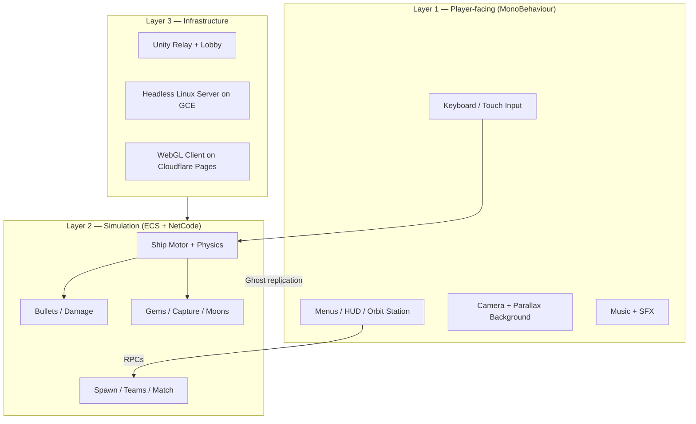

**Rule of thumb:**

1. **Layer 2 decides truth** — where ships are, who got hit, who owns a planet.
2. **Layer 1 shows truth** — draws meshes, plays sounds, captures clicks.
3. **Layer 3 connects players** — Relay routes packets; dedicated server runs Layer 2 with no screen.

## The north-star movement pipeline

This is the **most important diagram** in the project. Everything about ship feel flows from here.

```
Player presses W / touch stick
    ↓
ShipInputBridge (MonoBehaviour, every render frame)
    ↓
ShipPendingInput (staging buffer)
    ↓
ShipInputApplySystem (fixed step, GhostInputSystemGroup — client only)
    ↓
ShipInput on local ghost (NetCode input component)
    ↓
ShipClientPredictedMovementSystem (CLIENT)  ─┐
ShipMovementSystem (SERVER)                  ─┤ same job
    ↓                                        │
ShipMovementJob → ShipMovementBurstLogic     │
    ↓                                        │
ShipMotorSimulator (thrust, turn, brakes)    │
    writes: PhysicsVelocity.Linear           │
    writes: LocalTransform.Rotation          │
    does NOT write: Position                 │
    ↓                                        │
PhysicsSystemGroup (Unity Physics)           │
    integrates Position, resolves collisions │
    ↓                                        │
LocalTransform (sim state)                   │
    ↓                                        │
NetCode ghosts replicate + presentation      │
    ↓                                        │
ShipVisualSyncSystem → cache → EcsWorldVisualizer
    ↓
You see your ship on screen
```

**Key idea in plain language:** The motor is like a **steering wheel and throttle**. Unity Physics is like the **car’s wheels on the road**. NetCode is like **each player having a copy of the race** that gets corrected when the referee (server) disagrees.

---

# Part 2 — Project structure (folders and assemblies)

## Repository layout

```
Titan-Orbit/                          ← Git repo root
├── .cursor/rules/                    ← Architecture rules (ship sim, comments, rebuild)
├── tools/gce/                        ← Deploy scripts for Google Cloud server
└── Titan Orbit/                      ← Unity project
    ├── Assets/
    │   ├── Scripts/                  ← All first-party C# (see assemblies below)
    │   ├── Scenes/                   ← SampleScene + GameplaySubScene
    │   ├── Prefabs/                  ← Ships, planets, ECS ghosts
    │   ├── Data/                     ← ScriptableObject instances (cards, map)
    │   ├── Editor/Build/             ← WebGL + headless server build menus
    │   └── Resources/                ← Runtime-loaded config
    ├── Docs/                         ← This file + hosting notes
    └── BuildOutput/                  ← Built WebGL / server binaries
```

## Assemblies (how code is split)

Assemblies are **compiled chunks** with explicit dependencies. Think of them as “packages inside your game.”

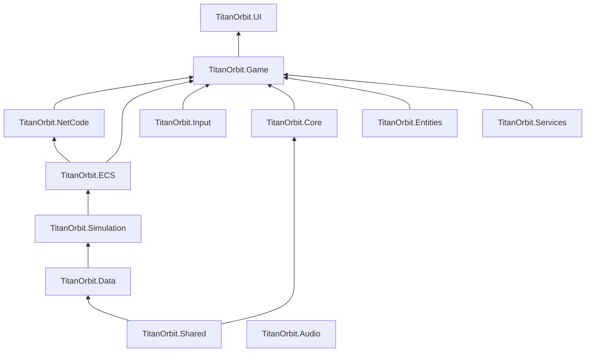

| Assembly | Folder | What lives here |
|----------|--------|-----------------|
| **Shared** | `Scripts/Shared/` | `TeamId`, toroidal math, `ShipDisplayPose` |
| **Data** | `Scripts/Data/` | ScriptableObjects — no ECS dependency |
| **Simulation** | `Scripts/Simulation/` | Pure math: motor, planet economy, bullet scale |
| **ECS** | `Scripts/ECS/` | Components, systems, ghost authoring |
| **NetCode** | `Scripts/NetCode/` | Bootstrap, session, Relay, tick rate |
| **Core** | `Scripts/Core/` | Small singletons, WebGL fixes, boot trace |
| **Game** | `Scripts/Game/` | **Hybrid bridges** — ECS ↔ GameObject |
| **UI** | `Scripts/UI/` | HUD, orbit station, minimap |
| **Input** | `Scripts/Input/` | New Input System handlers |
| **Entities** | `Scripts/Entities/` | Bullet VFX factory, equipment placement |
| **Services** | `Scripts/Services/` | Unity Gaming Services, IAP, ads |

**Why split this way?**

- **Simulation** has zero Unity scene dependencies → same math on client and server.
- **ECS** can reference Simulation but not UI.
- **Game** is allowed to glue ECS and GameObjects — that’s its job.
- **Data** designers can edit assets without touching netcode.

---

# Part 3 — Game flow: boot → menu → join → play

## Scene boot

Only one scene is in the build: `Assets/Scenes/SampleScene.unity`.

On load:

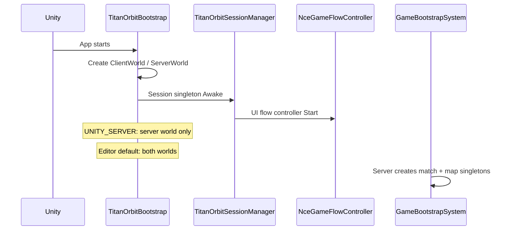

| Step | File | What happens |
|------|------|--------------|
| World creation | `NetCode/TitanOrbitBootstrap.cs` | Creates NetCode worlds per build type |
| Session | `NetCode/TitanOrbitSessionManager.cs` | Connection, Relay, lobby, team RPCs |
| UI state machine | `Game/NceGameFlowController.cs` | Shows correct panel |
| Server sim init | `ECS/Systems/GameBootstrapSystem.cs` | Match timer, map gen, bullet buffers |
| Go in-game | `NetCode/TitanOrbitGoInGameSystems.cs` | Client RPC → server marks connection in-game |

## UI flow state machine

`NceGameFlowController` is the **master conductor** for screens.

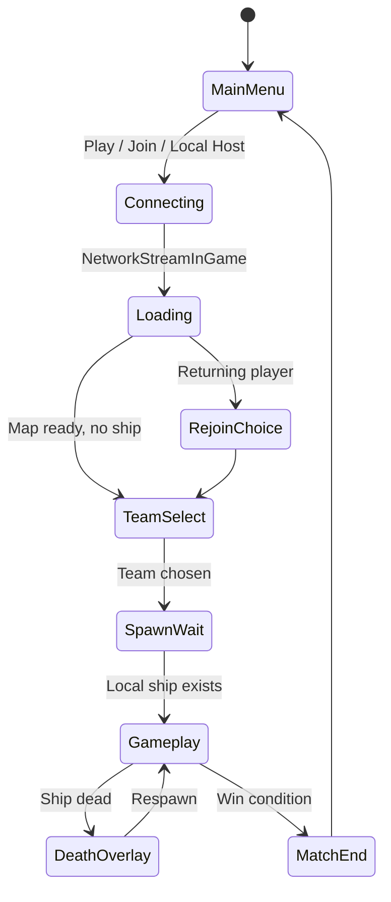

| Panel | Controller file |
|-------|-----------------|
| Main menu | `NceGameFlowController` |
| Lobby browser | `JoinGameBrowserController.cs` |
| Loading bar | `LoadingScreenControllerNce.cs` |
| Team pick | `TeamJoinButton.cs` + flow controller |
| Rejoin ship | `RejoinShipChoiceController.cs` |
| Gameplay HUD | `HudControllerNce.cs` |
| Death screen | `DeathScreenController.cs` |
| Orbit station | `UI/OrbitStationUI.cs` (largest UI file) |

## ECS read API for UI

UI does **not** query ECS directly everywhere. It uses:

**`Game/EcsGameBridge.cs`** — static helpers:

- Is network in-game?
- Map loading progress
- Local ship health, gems, team
- Planet/orbit state for station UI
- Which ECS world to read (client vs server on host)

This keeps UI code simpler and centralizes world-selection rules.

---

# Part 4 — Client, server, and dedicated server

## The three roles

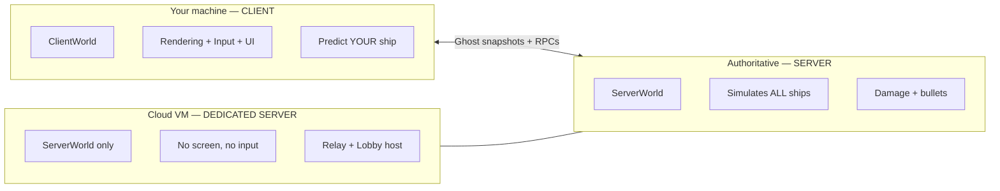

### What is a “world”?

In NetCode, a **world** is a separate ECS universe:

- **ClientWorld** — runs client systems, prediction, presentation
- **ServerWorld** — runs authoritative simulation

They are **not** two copies of the same scene in the normal sense — they are two DOTS worlds in one process (or one world on dedicated server).

## Build modes compared

| Aspect | Editor local host | Online client (WebGL / standalone) | Dedicated server (`UNITY_SERVER`) |
|--------|-------------------|-------------------------------------|-----------------------------------|
| Worlds | Client + Server | Client only (typical) | Server only |
| Who simulates your ship? | Client predicts; server authority | Client predicts; remote server authority | Server only (no local player) |
| Rendering | Full | Full | None (`-batchmode -nographics`) |
| Input | Keyboard / touch | Keyboard / touch | Reads **replicated** `ShipInput` from clients |
| Connection | LAN or Relay | Relay + Lobby join | Creates Relay allocation + Lobby |
| ECS ticking | Unity default | Unity default | **Manual** `TickServerWorld()` in `Update` |
| Visualization ECS world | Prefers **ServerWorld** on host | **ClientWorld** | N/A |

### Local host (development)

When you click **Local Host** in the editor:

1. Both ClientWorld and ServerWorld run.
2. Your machine **predicts** your ship on the client.
3. The **same machine’s server** simulates everyone authoritatively.
4. `ShipServerControlSystem` feeds keyboard input to the **server** ghost (host path).
5. `EcsGameBridge` often reads **ServerWorld** for visuals on host — subtle difference from dedicated clients.

### Dedicated online client

When a player joins via Relay:

1. Only **ClientWorld** matters for their screen.
2. Input goes: `ShipInputBridge` → NetCode ghost commands → server.
3. Server runs `ShipMovementSystem` for all ships.
4. Client runs `ShipClientPredictedMovementSystem` **only for their ship** (entities with `Simulate` tag).
5. Remote ships are **interpolated** from snapshots — not predicted.

### Dedicated server (production)

The Linux headless build on Google Cloud:

1. Compiled with `UNITY_SERVER` — client code stripped.
2. `TitanOrbitDedicatedServerBootRunner` auto-starts on load.
3. Creates Unity Relay allocation + UGS Lobby.
4. **`TitanOrbitSessionManager.Update`** calls `world.Update()` manually because headless builds don’t auto-tick ECS the same way.
5. No rendering, no `EcsWorldVisualizer`, no input handlers.
6. Logs to `DedicatedServerFileLog.cs`.

See also: `Docs/server-hosting-24_7.md` for systemd and match rotation (20 min / max players).

## Connection stack

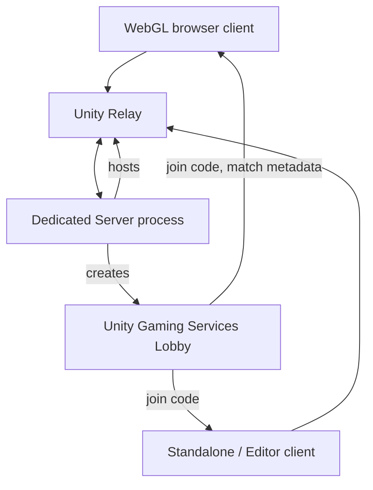

**Relay** = packet router so players don’t need open ports.  
**Lobby** = match browser metadata (`IsOpen`, `IsLatest`, `RelayJoinCode`).

## Go-in-game handshake

Before ghosts replicate properly, the client must send:

**`GoInGameRequest` RPC** → server sets `NetworkStreamInGame`.

Without this, you can connect but see nothing happen. Implemented in `TitanOrbitGoInGameSystems.cs`.

## RPCs vs ghost replication

| Mechanism | Used for | Example |
|-----------|----------|---------|
| **Ghost components** | Continuous state every tick | Position, health, gems, velocity |
| **RPC** | One-shot validated actions | Pick team, buy upgrade, toggle deposit |
| **Input commands** | Per-tick player intent | Thrust, aim, fire |

**File:** `ECS/Components/NetworkCommands.cs` — all RPC structs.

**Why `ShipDepositIntent` exists:** `ShipInput.WantDepositGems` can be **lost during prediction rollback**. Deposit toggle is stored in a separate ghost field + `SetWantDepositGemsCommand` RPC. See `ShipDepositIntent.cs`.

---

# Part 5 — ECS / DOTS for Titan Orbit

## ECS in 60 seconds

| Concept | Analog | In Titan Orbit |
|---------|--------|----------------|
| **Entity** | Row ID in a database | One ship, one planet, one bullet |
| **Component** | Column of data | `ShipState`, `LocalTransform`, `ShipInput` |
| **System** | SQL query + update | `ShipMovementSystem`, `BulletSimulationSystem` |
| **Authoring / Baker** | Import spreadsheet → DB | `StarshipGhostAuthoring` bakes prefab → entity components |

**Old Unity way:** `Ship.cs` MonoBehaviour holds everything.  
**ECS way:** `ShipState` + `ShipMotorConfig` + `PhysicsVelocity` on same entity; systems read/write slices.

## World filters — who runs what

Systems declare `[WorldSystemFilter(...)]`:

| Filter | Runs on |
|--------|---------|
| `ClientSimulation` | ClientWorld only |
| `ServerSimulation` | ServerWorld only |
| `ClientSimulation \| ServerSimulation` | Both |

Examples:

- `ShipClientPredictedMovementSystem` → **Client only**
- `ShipMovementSystem` → **Server only**
- `TitanOrbitPhysicsBootstrapSystem` → **Both** (lag compensation config)
- `BulletSimulationSystem` → **Server only** (damage authority)
- `ShipVisualSyncSystem` → **Both** (presentation cache)

## System groups — execution order

Think of groups as **pipelines within a frame**:

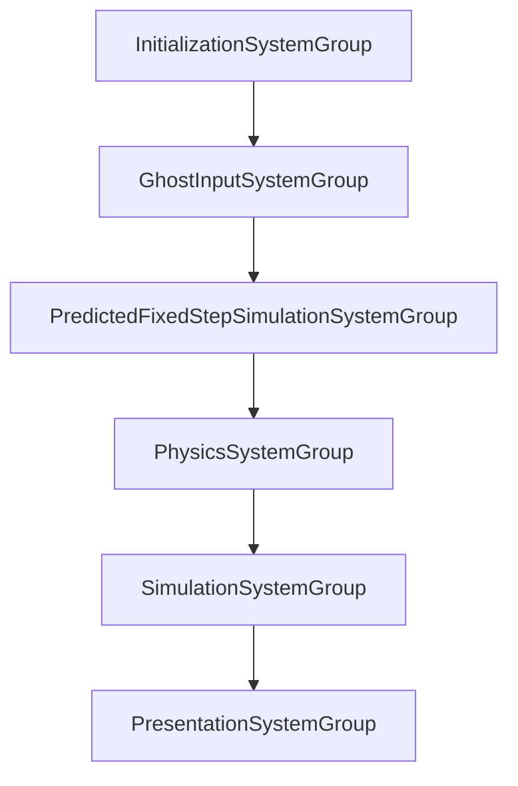

**Critical ordering for ships:**

1. `GhostInputSystemGroup` — copy input onto ghost
2. `ShipClientPredictedMovementSystem` / `ShipMovementSystem` — motor **before** physics
3. `PhysicsSystemGroup` — move hull, collide
4. `BulletSimulationSystem` — after movement (server)
5. `PresentationSystemGroup` — `ShipVisualSyncSystem` **last**

## Ghost authoring

ECS entities for networked objects are **baked from prefabs**:

| Prefab | Authoring file |
|--------|----------------|
| Ship | `ECS/Authoring/StarshipGhostAuthoring.cs` |
| Planet | `ECS/Authoring/PlanetGhostAuthoring.cs` |
| Asteroid | `ECS/Authoring/AsteroidGhostAuthoring.cs` |
| Gem | `ECS/Authoring/GemGhostAuthoring.cs` |

Ship bake highlights:

- Dynamic **sphere collider** on `Ship` physics layer
- `InverseInertia = 0` — collisions don’t spin the ship
- `ShipInput` implements `IInputComponentData` for NetCode
- Weapon mount buffers for bullet spawn points

**Editor setup menu:** `Titan Orbit → Setup NetCode Game (Full)` in `ECS/Editor/NetCodeGameSetup.cs`.

## Key ship components

| Component | Ghost-serialized? | Purpose |
|-----------|-------------------|---------|
| `ShipInput` | Via input commands | Thrust, aim, fire, brakes |
| `ShipState` | Yes | Health, team, gems, death |
| `ShipKinematics` | Yes | Velocity mirror for gameplay |
| `ShipMotorConfig` | No | Recomputed from loadout server-side |
| `PhysicsVelocity` | Sim-only | Linear vel for physics |
| `LocalTransform` | Yes | Position + rotation |
| `ShipOrbitState` | Yes | In orbit ring? which planet? |
| `ShipMoonDockState` | Yes | Moon landing progress |

## Burst and jobs

**Goal:** Hot sim paths compile to fast native code.

Current state:

- ✅ `ShipMovementJob` — `[BurstCompile] IJobEntity`
- ✅ `ShipMovementBurstLogic.Step` — inlined motor in Burst
- ✅ `BulletSimulationSystem` — Burst `ISystem`
- ⏳ Some `Game/` systems still `SystemBase` (migration target)
- ⏳ `GemTractorBeamSystem` — managed dictionaries, not Burst yet

**Why `ShipMovementLogic` split in two classes:**

- `ShipMovementLogic` — managed, reads `MapStateSingleton` on main thread
- `ShipMovementBurstLogic` — Burst-safe motor math

---

# Part 6 — NetCode for Titan Orbit

## Ghosts

A **ghost** is NetCode’s replicated entity. Each client has ghost **copies** of ships/planets. The server has the **authoritative** originals.

**Owner prediction:** Your ship on your machine runs with the `Simulate` tag → client prediction loop.

**Remote players:** You receive snapshots at network rate → interpolation → smooth-ish motion on *their* proxies.

## Tick rate

**File:** `NetCode/TitanOrbitServerTickRateSystem.cs`

| Setting | Value |
|---------|-------|
| Simulation tick rate | **60 Hz** |
| Network tick rate | **60 Hz** |
| Max catch-up steps per frame | 4 |

**What this means:** The sim advances in **1/60 second steps** (~16.67 ms). If your monitor runs at 144 FPS, most frames **do not** advance sim — or multiple sim steps catch up after a hitch.

This fixed stepping is **correct** for networked games but is a major source of “stepped” feel if render and sim aren’t aligned.

## Lag compensation

**File:** `ECS/Systems/TitanOrbitPhysicsBootstrapSystem.cs`

Both client and server configure `LagCompensationConfig` so predicted physics can **rewind** for hit detection consistency.

## Prediction rollback

When server snapshot disagrees with client prediction:

1. NetCode rolls back local predicted state
2. Re-simulates forward with correct history
3. `GhostPredictionSmoothing` eases visual correction

**Do not** add extra `Lerp` on the local ship proxy — it fights this mechanism.

---

# Part 7 — Ship movement: from simple to complex

## Level 1 — Input (simplest)

**Files:** `Input/PlayerInputHandler.cs`, `Input/MobileInputHandler.cs`, `Game/ShipInputBridge.cs`

```
Keyboard / touch
    → PlayerInputHandler reads Unity Input System
    → ShipInputBridge.Update() (every render frame)
    → ShipPendingInput (staging)
    → ShipInputApplySystem (fixed step, client)
    → ShipInput on ghost
```

**Why two steps (bridge + apply)?** MonoBehaviour runs on render frames; sim runs on fixed steps. The pending buffer **bridges** frame rate to tick rate.

## Level 2 — Motor math

**File:** `Simulation/ShipMotorSimulator.cs`

Per tick:

1. Rotate toward aim point (slerp, clamped by `rotationSpeed × dt`)
2. If in orbit ring and not thrusting → blend velocity toward tangential orbit speed
3. Else apply thrust along forward, space brakes, recoil decay
4. If `integratePosition: false` → **stop** — don’t move position here

**Ships always use `integratePosition: false`.** Position comes from physics.

## Level 3 — Burst motor step

**File:** `ECS/Systems/ShipMovementLogic.cs` → `ShipMovementBurstLogic.Step`

Extra game rules before/after motor:

| Check | Behavior |
|-------|----------|
| Dead or picking team | Zero velocity |
| Landed on friendly moon, no thrust | Pin in place |
| Effective mass | More HP + current gems/people → slower acceleration (F/m) |
| Capacity tax | High maxGems/maxPeople → lower MaxSpeed, accel, turn (empty hold) |
| Orbit ring | Auto-orbit when coasting near planet |
| Shield repel | Enemy moon shields push velocity outward (no physics collider) |

Writes:

- `physicsVelocity.Linear`
- `transform.Rotation`
- `kinematics.Velocity` (gameplay mirror)
- Does **not** write `transform.Position`

## Level 4 — Physics

**Layer setup:** `ECS/TitanOrbitPhysicsLayers.cs`

| Entity | Body | Collides with |
|--------|------|---------------|
| Ship | Dynamic sphere | Ships, planets, asteroids |
| Planet / asteroid | Static sphere | Ships, world, gems |
| Gem | Scripted | World only — **not** ship hull |

Physics integrates **position** and applies bounce (restitution ~0.5).

## Level 5 — Client vs server systems

| System | World | Query |
|--------|-------|-------|
| `ShipClientPredictedMovementSystem` | Client | `ShipTag` + `Simulate` |
| `ShipMovementSystem` | Server | `ShipTag` + `Simulate` |

Both schedule the **same** `ShipMovementJob`. That sameness is what makes prediction work.

## Level 6 — Presentation

```
LocalTransform (after presentation group)
    → ShipVisualSyncSystem (OrderLast)
    → GhostPresentationTransformCache
    → EcsWorldVisualizer.LateUpdate
    → GameObject proxy transform
    → ShipDisplayPose (for camera)
    → CameraFollowEcs
```

**File:** `Game/EcsWorldVisualizer.cs` — `ApplyShipProxyTransform`:

> No extra lerp on the local owner — prediction + GhostPredictionSmoothing own sim feel.

---

# Part 8 — Choppy and stepped ship movement (the hard problem)

This section answers: **“Where does the choppiness come from?”**

## Mental model: three clocks

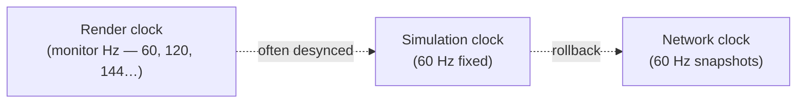

Your **eyes** run at render rate.  
Your **ship sim** runs at 60 fixed steps per second.  
**Network** also thinks in 60 Hz chunks.

When these aren’t aligned, movement can feel **stepped**, **stuttery**, or **rubber-bandy** — even when the code is “correct.”

## Where stepping is introduced (by design)

### 1. Fixed simulation timestep (primary source)

**Location:** `TitanOrbitServerTickRateSystem` — 60 Hz

The motor runs **once per sim tick**, not once per render frame:

```
Tick 0: position P0, velocity V
Tick 1: position P1 (physics integrated)
...
```

If render reads sim state **between** ticks without interpolation, you see **jumps every ~16.7 ms**.

**On your local predicted ship:** NetCode prediction + presentation phase should smooth this. If something reads **raw sim** instead of **presentation**, you see steps.

### 2. Physics integration step

**Location:** `PhysicsSystemGroup` after motor

Motor sets velocity; physics moves position in **discrete** solver steps. Collisions can add micro-impulses — bounce reads as a small kick.

**Especially visible when:** Bouncing off another ship or skimming a planet sphere.

### 3. Presentation phase boundaries

**Location:** `ShipVisualSyncSystem` in `PresentationSystemGroup`

Correct pipeline:

```
Sim transform → NetCode presentation/interpolation → cache → proxy
```

Incorrect pipeline (causes jitter):

```
Sim transform → proxy directly in LateUpdate  ❌
```

**Rule:** Camera and proxies should use **presentation** pose. `ShipDisplayPose` exists specifically to avoid double-smoothing or sim-read jitter.

### 4. Prediction rollback corrections

**Location:** NetCode prediction system (built-in)

When server disagrees:

```
Client thought:  position X
Server says:     position Y
→ rollback + resim → GhostPredictionSmoothing eases to Y
```

Feels like a small **snap** or **correction**. Worse on high latency or if motor isn’t deterministic.

**Deposit toggle bug (related):** Input rollback can drop `WantDepositGems` — hence separate `ShipDepositIntent` component.

### 5. Remote ships (not your ship)

**Location:** Ghost interpolation on non-owned ships

You do **not** predict remote ships. You interpolate snapshots:

```
Snapshot t0 ---- interpolated ---- Snapshot t1
```

Under packet jitter, remote ships look **smoother but laggy**. Your ship should feel **instant** — if it doesn’t, prediction path is broken.

### 6. Host-specific dual-world reads

**Location:** `EcsGameBridge.GetVisualizationWorld()`

| Mode | Visualization world |
|------|---------------------|
| Local host | Often **ServerWorld** |
| Dedicated client | **ClientWorld** |

Host camera/proxies may read **different transform timeline** than a pure client. Can feel subtly different when testing host vs joining remotely.

### 7. Manual server tick on headless

**Location:** `TitanOrbitSessionManager.TickServerWorld()` (`UNITY_SERVER`)

Headless server pumps `world.Update()` once per Unity frame. If server frame rate drifts or hitches, sim cadence wobbles → clients see inconsistent snapshot timing.

### 8. Render vs sim frame mismatch (WebGL)

**Location:** `Core/CrossPlatformManager.cs` — WebGL targets 60 FPS

WebGL in a browser can **miss frames** under load. Client may run **multiple sim catch-up steps** (`MaxSimulationStepsPerFrame = 4`) in one render frame → bursty motion.

## Diagram: where choppiness can enter

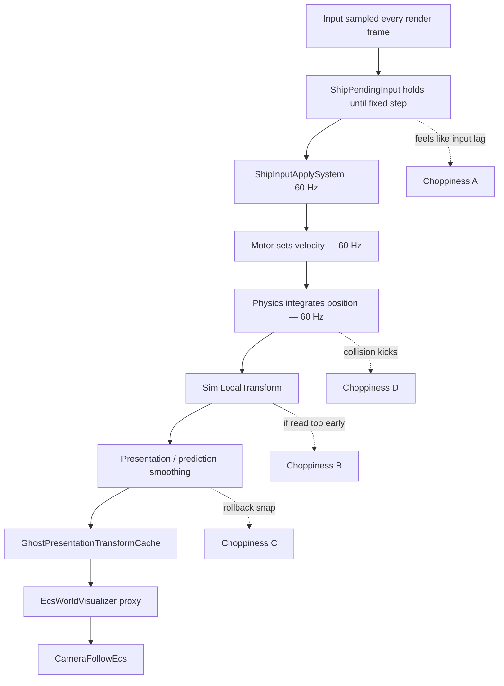

| Label | Symptom | Likely cause |
|-------|---------|--------------|
| **A** | Input feels mushy | Pending input waits for next fixed step |
| **B** | Jittery local ship | Reading sim not presentation |
| **C** | Rubber band | Prediction mismatch + rollback |
| **D** | Bumps on contact | Physics bounce — expected |

## What we intentionally do NOT do

From `.cursor/rules/titan-orbit-ship-simulation.mdc`:

| Forbidden “fix” | Why |
|-----------------|-----|
| Extra `Lerp` on local owner proxy | Hides rollback; adds lag; desyncs camera |
| `LateUpdate` ECS sim reads for movement | Wrong phase — jitter |
| Remove client prediction | “Fixes” feel by adding input lag |
| Custom teleport collision for ships | Fights Unity Physics authority |
| Fork motor into client-only copy | Prediction breaks — must be identical |

## Approved tuning knobs (when chasing feel)

1. **Tick rate** — `TitanOrbitServerTickRateSystem` (currently 60/60)
2. **GhostPredictionSmoothing** — NetCode owner rollback easing
3. **Physics step / solver** — Unity Physics project settings
4. **Input buffering** — NetCode input command queue
5. **Cosmetic smoothing** — UI sticks, bank VFX, moon dock cinematics (not hull position)

## Incomplete hardening (known tech debt)

| Item | File | Status |
|------|------|--------|
| `LastSimTick` in motor state | `Simulation/ShipMotorState.cs` | Documented for rollback detection, **not checked yet** |
| Client tick rate system | `TitanOrbitClientTickRateSystem.cs` | **No-op** — uses defaults |
| Weapon mount GameObject → ECS | `ShipWeaponMountSyncSystem.cs` | Server reads visual hull each frame — ordering sensitive |
| Burst migration | Several `Game/` systems | Still `SystemBase` |
| `ClientLocalBulletVfxBridge` | `Game/ClientLocalBulletVfxBridge.cs` | LateUpdate ECS reads — should move to presentation events |

## How to debug movement feel

1. **Confirm prediction is running** — breakpoint in `ShipClientPredictedMovementSystem.OnUpdate`; local ship must have `Simulate`.
2. **Confirm proxy uses cache** — `GhostPresentationTransformCache.TryGetShip`.
3. **Compare host vs dedicated client** — same build, join remote server; feel should match.
4. **Log sim vs render dt** — large `Time.deltaTime` spikes → catch-up steps.
5. **Watch rollback** — NetCode stats / prediction error counters in editor.

---

# Part 9 — Hybrid presentation (ECS sim + GameObject visuals)

## Why hybrid?

You have beautiful **USC ship prefabs**, planet VFX, Shapes UI lines — all built for GameObjects. Entities Graphics could render ECS directly, but migration cost is huge.

**Pattern:** ECS = truth. GameObject = **picture**.

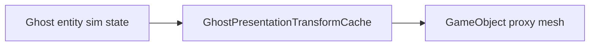

## Key files

| File | Role |
|------|------|
| `ShipVisualSyncSystem.cs` | ECS system → fills cache after presentation |
| `GhostPresentationTransformCache.cs` | Per-frame dictionary (marked temporary bridge) |
| `EcsWorldVisualizer.cs` | Spawns/destroys/syncs all proxies |
| `ShipVisualApplier.cs` | Builds ship mesh from family + loadout |
| `WorldBodyVisualApplier.cs` | Planets / asteroids |
| `GemVisualApplier.cs` | Gem meshes |
| `ShipDisplayPose.cs` | Local ship pose for camera |

## Bidirectional bridges (hard areas)

Usually data flows **ECS → GameObject**. Two exceptions:

### Weapon mounts (GameObject → ECS)

**File:** `Game/ShipWeaponMountSyncSystem.cs`

Server reads **visual hull** bone transforms → writes `ShipWeaponMountElement` buffer → `BulletSimulationSystem` uses for muzzle origin.

**Runs:** After movement, before bullets.

**Risk:** If visual prefab desyncs from sim position, bullets spawn from wrong point.

### Moon dock cinematic (client override)

**Files:** `ShipMoonDockSystem.cs` (server), `ShipMoonDockVisualApplier.cs` (client)

Server pins ship kinematics for landing. Client may **override** proxy transform for cinematic approach. Can look slightly different from server truth during landing — acceptable for cosmetic dock, dangerous if extended to combat.

---

# Part 10 — Combat and bullets

## Authority model

| What | Where | Authority |
|------|-------|-----------|
| Hit detection | `BulletSimulationSystem.cs` | **Server only** |
| Damage / death | Same + `ShipDeathRecordingSystem` | **Server** |
| Tracer visuals | `BulletPresentationSystem` + `EcsWorldVisualizer` | Cosmetic |
| Local shot anticipation | `ClientLocalBulletVfxBridge.cs` | Cosmetic only |

## Server bullet pipeline

```
ShipWeaponMountSyncSystem (muzzle poses)
    ↓
BulletSimulationSystem
    - spawn from ShipInput.Fire
    - toroidal segment collision
    - damage application
    - spawn/hit event buffers
    ↓
BulletPresentationSystem
    - creates BulletTracerState entities
    ↓
EcsWorldVisualizer.DrawBullets
    - BulletVisualFactory builds particle meshes
```

**Shared math:** `ECS/Systems/BulletCollision.cs`, `Simulation/BulletVisualScale.cs`

**Muzzle pose:** `ShipWeaponPose.TryResolve` — shared between sim and VFX.

---

# Part 11 — Economy: gems, planets, moons, orbit

## Gem lifecycle

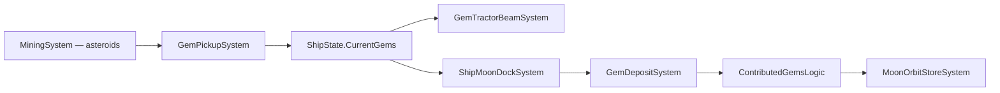

| System | File |
|--------|------|
| Mining | `GemEconomySystems.cs` |
| Pickup / deposit | Same |
| Tractor beam | `GemTractorBeamSystem.cs` |
| Moon dock | `ShipMoonDockSystem.cs` |
| Moon store RPCs | `MoonOrbitStoreSystem.cs` |
| Shield combat | `PlanetGemMoonShieldSystem.cs`, `PlanetGemMoonCombatLogic.cs` |
| Population growth | `PlanetPopulationGrowthSystem.cs` |
| Win condition | `CaptureSystem.cs` — one team owns all non-neutral planets |

**Math in Simulation/:** `PlanetEconomyMath.cs`, `PlanetGemMoonMath.cs`, `PlanetOrbitMath.cs`, `GemTractorBeamMath.cs`

## Orbit motor

When coasting in a planet’s ring without thrusting, `ShipMovementBurstLogic` enables **orbit mode**:

- `PlanetOrbitMath` computes tangential desired velocity
- Motor lerps current velocity toward orbit speed

Thrust or firing **cancels** orbit — player intent wins.

---

# Part 12 — Teams, spawn, rejoin

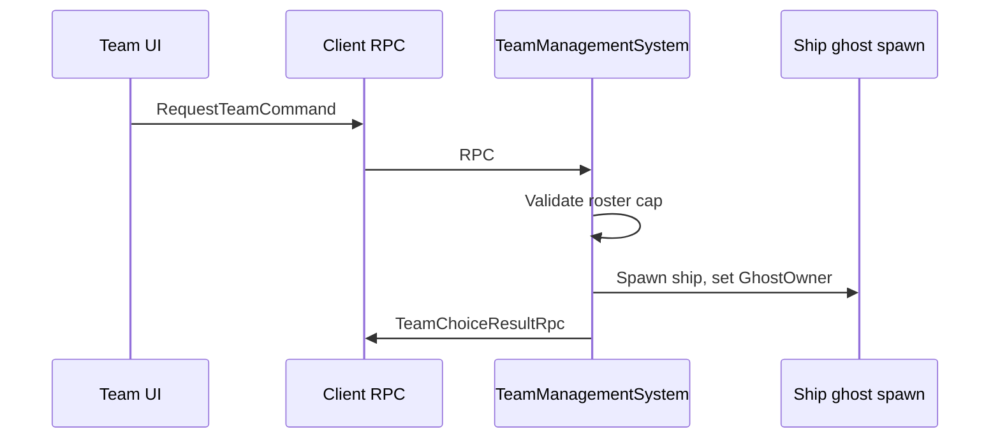

| File | Role |
|------|------|
| `TeamManagementSystem.cs` | Server spawn + team assignment |
| `TeamChoiceResultClientSystem.cs` | Client handles result |
| `RejoinShipManagementSystem.cs` | Returning player ship resume |
| `ShipRespawnSystem.cs` | Death → respawn timer |

**Team ID:** `Shared/TeamId.cs` — five teams + None.  
**Legacy shim:** `Core/TeamManager.cs` maps old `Team` enum for some UI.

---

# Part 13 — Map generation

**Server-only** procedural layout:

| File | Role |
|------|------|
| `MapGenerationLogic.cs` | Pure placement algorithm |
| `GameBootstrapSystem.cs` | `MapGenerationSystem` — phased spawning |
| `MapGenerationSettings.cs` | Designer SO for bounds/counts |

Flow:

1. Server starts generation → `MapStateSingleton.LoadingComplete = false`
2. Planets/asteroids spawn from queue across frames
3. Clients see loading UI via replicated `MapStateSingleton`
4. When done → team selection unlocks

---

# Part 14 — UI deep dive

## Gameplay HUD

| File | Shows |
|------|-------|
| `HudControllerNce.cs` | HP, gems, match timer |
| `ShipSpeedometerHUD.cs` | Speed, mass, DPS (reads ECS) |
| `ShipAttributeUpgradeHUD.cs` | In-match upgrades |
| `MinimapController.cs` + `MinimapEcsEntitySync.cs` | Radar blips |

## Orbit station (largest UI surface)

**`UI/OrbitStationUI.cs`** — loadout grids, card shop, ship tree, store purchases.

- Reads ECS context via `OrbitStationEcsContext.cs`
- Sends RPCs: `PurchaseShipUpgradeCommand`, `PurchaseStoreItemCommand`, etc.
- Still bridges some **legacy NGO stubs** (`LegacyNetcodeStubs.cs`) — mechanical rename deferred

## Mobile

| File | Role |
|------|------|
| `MobileInputHandler.cs` | Touch steer + shoot |
| `MobileControls.cs` | Canvas wiring |
| `MobileSteerVisualUI.cs` | Cosmetic stick smoothing (OK — not sim) |

---

# Part 15 — Data layer (designer assets)

## ScriptableObject pipeline

Designers edit assets in Inspector → runtime loads → ECS bakers or systems read.

| Asset type | Purpose |
|------------|---------|
| `ShipFamilyDefinition` | Ship family chassis per level |
| `ShipPartCatalog` | All USC module definitions |
| `CardData` / `CardDeckDefinition` | Shop cards and pools |
| `WeaponConfig` | Bullet banks and weapon stats |
| `MapGenerationSettings` | Map size, planet counts |
| `TitanOrbitMultiplayerConfig` | Dev toggles (local play buttons) |

**Pure data assembly:** `TitanOrbit.Data` — safe for designers, no network code.

**Stat aggregation:** `ShipFamilyStatsCalculator.cs`, `ShipComponentAbilityStatsMath.cs`

---

# Part 16 — Input system

## Desktop

**`Input/PlayerInputHandler.cs`**

| Action | Key / control |
|--------|---------------|
| Move / thrust | WASD / stick |
| Aim | Mouse |
| Shoot | Mouse button |
| Space brakes | Ctrl |
| Expel gems | V |
| Cycle bullet bank | B |

## Pipeline diagram

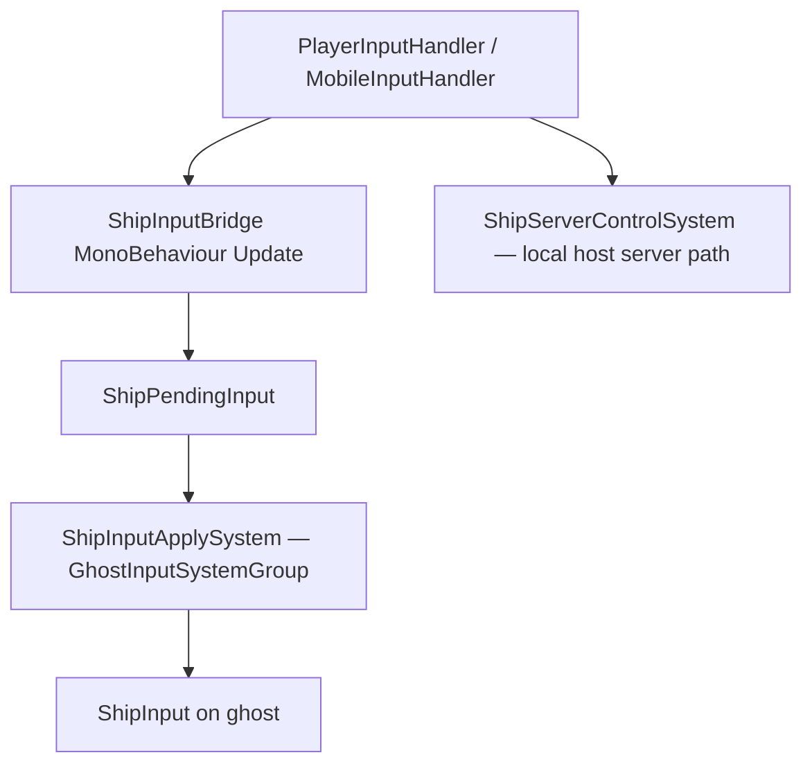

**`ClientCommandTargetSystem`** — wires `CommandTarget` so NetCode knows which ghost receives your input (dedicated clients).

---

# Part 17 — Audio and camera

## Audio

**`Audio/AudioManager.cs`** — singleton for music + pooled SFX (weapons, gems, explosions, capture, etc.)

Triggered from presentation bridges (e.g. hits in `EcsWorldVisualizer`).

## Camera

| File | Role |
|------|------|
| `CameraFollowEcs.cs` | Follow local ship top-down; reads `ShipDisplayPose` |
| `ScrollingSpaceBackground.cs` | Parallax nebula; follows `ShipDisplayPose` |
| `CameraTheatricalOrbit.cs` | Menu cinematics — **not** gameplay follow |

**No smoothing on gameplay follow** — intentional per ship-simulation rule.

---

# Part 18 — Build, WebGL, and deploy

## Build menus

**`Editor/Build/TitanOrbitBuildAutomation.cs`**

| Menu item | Output |
|-----------|--------|
| WebGL Production | `BuildOutput/WebGL/production` |
| Headless Server (Linux — GCE) | `BuildOutput/Server/TitanOrbitLinux1` |
| Headless Server (Windows) | `BuildOutput/Server/headless-windows` |

## WebGL-specific fixes

| File | Fix |
|------|-----|
| `WebGLTextureImportBuildFix.cs` | Texture compression for browser |
| `WebGLGameplayRenderCompat.cs` | Disable SRP batcher (MPB bug) |
| `ShapesWebGLImmediateModeFix.cs` | Shapes orbit rings |
| `CloudflarePagesPostBuild.cs` | COOP/COEP headers |

## When to rebuild headless server

See `.cursor/rules/titan-orbit-headless-server-rebuild.mdc`:

- **Required** after ECS sim, NetCode, shared motor, ghost components, RPCs
- **Not required** for pure UI/VFX/client-only presentation

---

# Part 19 — Best practices implemented in this project

## Software engineering

| Practice | Where |
|----------|-------|
| **Single source of truth for motor** | `ShipMovementBurstLogic` — one path client + server |
| **Assembly separation** | Data / Sim / ECS / Game layers |
| **Pure functions for sim math** | `Simulation/*Math.cs`, `MapGenerationLogic.cs` |
| **Static bridge APIs** | `EcsGameBridge`, `ShipDisplayPose` — reduce scattered ECS queries |
| **Server authority for damage** | `BulletSimulationSystem` server-only |
| **RPC for discrete actions** | Store purchases, team pick — validated server-side |
| **Educational comments** | Every touched file teaches pipeline + tags `[NETCODE]` etc. |

## Multiplayer best practices

| Practice | Implementation |
|----------|----------------|
| Client-side prediction | `ShipClientPredictedMovementSystem` + `Simulate` tag |
| Fixed timestep | 60 Hz sim + network |
| Lag compensation config | Both worlds in physics bootstrap |
| Input commands via NetCode | `ShipInput : IInputComponentData` |
| Ghost-serialized state | `ShipState`, transforms, vitals |
| Go-in-game handshake | Before replication |
| Relay + Lobby | No player port forwarding |

## Unity / DOTS best practices

| Practice | Implementation |
|----------|----------------|
| Physics owns position | Motor sets velocity only |
| Burst hot paths | Movement job, bullet sim |
| Pre-baked components | Ghost authoring, `ShipEnsureComponentsSystem` |
| System ordering attributes | `[UpdateBefore(PhysicsSystemGroup)]` |
| Presentation group for rendering reads | `ShipVisualSyncSystem` OrderLast |

---

# Part 20 — Custom Titan Orbit choices (and WHY)

| Choice | Why |
|--------|-----|
| **Hybrid GameObject proxies** | Reuse USC art; ship-simulation rule forbids sim on proxies |
| **Custom motor, not Rigidbody forces** | Deterministic, identical client/server, orbit + shield overlays |
| **Toroidal map** | Seamless wrap — `ToroidalMapEcs` in distance checks |
| **Moon shields as velocity repel, not colliders** | Moons lack physics bodies; repel must be deterministic in motor |
| **InverseInertia = 0** | Top-down shooter — ships shouldn’t spin from glancing hits |
| **Separate `ShipDepositIntent`** | NetCode input rollback drops toggle otherwise |
| **60 Hz sim AND network** | Responsive snapshots; speeds are units/sec not “per tick” |
| **Manual headless ECS tick** | Unity batch mode doesn’t pump worlds automatically |
| **Host reads ServerWorld for viz** | Practical for MPPM; documented host/client asymmetry |
| **Card tetris loadouts** | Designer-driven build variety from `CardData` grid |
| **Five teams** | `TeamId` enum — asymmetric team modes |
| **No local owner proxy lerp** | Fights prediction rollback smoothing |

---

# Part 21 — Hard areas and migration roadmap

## Current hard problems (honest assessment)

### 1. Ship movement feel under net + physics + hybrid render

**Difficulty: ★★★★★**

Multiple clocks, prediction rollback, physics bounce, presentation phase — see [Part 8](#part-8-choppy-and-stepped-ship-movement-the-hard-problem).

### 2. Hybrid ECS ↔ GameObject bidirectional bridges

**Difficulty: ★★★★☆**

Weapon mounts, moon dock cinematics, orbit station legacy stubs.

### 3. Gem economy chain spans many systems

**Difficulty: ★★★★☆**

Mining → pickup → tractor → dock → deposit → contributed ledger → store RPCs. Hard to debug without server log.

### 4. WebGL rendering edge cases

**Difficulty: ★★★☆☆**

SRP batcher, texture compression, Shapes immediate mode, COOP/COEP.

### 5. Burst migration incomplete

**Difficulty: ★★★☆☆**

Movement/bullets partially Burst; tractor beam and Game-folder systems still managed.

### 6. Legacy NGO UI types

**Difficulty: ★★☆☆☆**

`OrbitStationUI` still uses stub types — works via ECS RPC façade but confusing to read.

## Migration targets (from architecture rules)

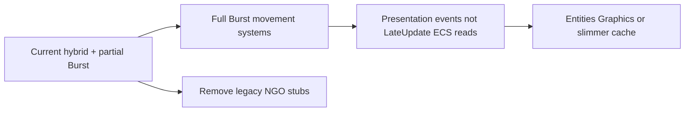

| From | To |
|------|-----|
| `SystemBase` visual sync | Burst `ISystem` |
| `GhostPresentationTransformCache` | Entities Graphics or direct presentation reads |
| `ClientLocalBulletVfxBridge` LateUpdate | Presentation spawn events |
| `EcsWorldVisualizer` local lerp | Already removed — keep it gone |
| Managed motor `EntityManager` in hot path | Pre-baked queries in jobs |

---

# Part 22 — How to read the codebase (study guide)

## Week 1 — Foundations

| Day | Read | Goal |
|-----|------|------|
| 1 | This guide Parts 0–4 | Macro + multiplayer roles |
| 2 | `.cursor/rules/titan-orbit-ship-simulation.mdc` | Movement law |
| 3 | `TitanOrbitBootstrap.cs`, `TitanOrbitSessionManager.cs` (skim) | Worlds + connection |
| 4 | `NceGameFlowController.cs` | UI state machine |
| 5 | `EcsGameBridge.cs` (skim sections) | How UI reads ECS |

## Week 2 — Ship pipeline (micro)

| Day | Read | Goal |
|-----|------|------|
| 1 | `PlayerInputHandler` → `ShipInputBridge` → `ShipInputApplySystem` | Input |
| 2 | `ShipMotorSimulator.cs` | Motor math |
| 3 | `ShipMovementLogic.cs`, `ShipMovementJob.cs` | Burst step |
| 4 | `ShipClientPredictedMovementSystem`, `ShipMovementSystem` | Client vs server |
| 5 | `StarshipGhostAuthoring.cs`, `TitanOrbitPhysicsLayers.cs` | Bake + layers |

## Week 3 — Presentation + combat

| Day | Read | Goal |
|-----|------|------|
| 1 | `ShipVisualSyncSystem`, `GhostPresentationTransformCache` | Cache |
| 2 | `EcsWorldVisualizer.cs` (ship sections) | Proxies |
| 3 | `CameraFollowEcs`, `ShipDisplayPose` | Camera law |
| 4 | `BulletSimulationSystem.cs` | Server combat |
| 5 | `BulletPresentationSystem`, `BulletVisualFactory` | VFX |

## Week 4 — Gameplay systems

| Day | Read | Goal |
|-----|------|------|
| 1 | `MapGenerationLogic`, `GameBootstrapSystem` | Map |
| 2 | `TeamManagementSystem` | Teams |
| 3 | `GemEconomySystems.cs` | Economy |
| 4 | `MoonOrbitStoreSystem`, `ShipMoonDockSystem` | Moons |
| 5 | `OrbitStationUI.cs` (skim structure) | Player progression UI |

## Debugging exercises

1. **Trace one thrust input** — breakpoint `ShipInputBridge` → `ShipInputApplySystem` → `ShipMovementBurstLogic.Step`.
2. **Find your ship entity** — `LocalPlayerShipTag` query in client world.
3. **Watch presentation cache** — log `GhostPresentationTransformCache` vs raw `LocalTransform` same frame.
4. **Host vs client** — log `EcsGameBridge.GetVisualizationWorld()` name.
5. **Server log** — run headless Windows build; read `DedicatedServerFileLog` output.

---

# Part 23 — Appendix: key file index

## Boot and session

| File | One line |
|------|----------|
| `NetCode/TitanOrbitBootstrap.cs` | Creates client/server worlds |
| `NetCode/TitanOrbitSessionManager.cs` | Relay, lobby, connect, team RPCs |
| `NetCode/TitanOrbitDedicatedServerBootRunner.cs` | Headless auto-start |
| `NetCode/TitanOrbitGoInGameSystems.cs` | In-game handshake |
| `NetCode/TitanOrbitServerTickRateSystem.cs` | 60 Hz sim + net |

## Ship movement

| File | One line |
|------|----------|
| `Simulation/ShipMotorSimulator.cs` | Thrust/turn/brake math |
| `ECS/Systems/ShipMovementLogic.cs` | Burst motor step |
| `ECS/Systems/ShipMovementJob.cs` | Parallel job |
| `ECS/Systems/ShipMovementSystem.cs` | Server movement |
| `ECS/Systems/ShipClientPredictedMovementSystem.cs` | Client prediction |
| `ECS/Systems/ShipInputApplySystem.cs` | Input onto ghost |
| `ECS/Systems/TitanOrbitPhysicsBootstrapSystem.cs` | Gravity zero, lag comp |
| `Game/ShipInputBridge.cs` | MonoBehaviour input staging |
| `Game/ShipServerControlSystem.cs` | Host server input |

## Presentation

| File | One line |
|------|----------|
| `Game/ShipVisualSyncSystem.cs` | Fills presentation cache |
| `Game/GhostPresentationTransformCache.cs` | Static pose dictionary |
| `Game/EcsWorldVisualizer.cs` | All visual proxies |
| `Game/CameraFollowEcs.cs` | Camera follow |
| `Shared/ShipDisplayPose.cs` | Local ship pose for camera |

## Combat

| File | One line |
|------|----------|
| `ECS/Systems/BulletSimulationSystem.cs` | Server bullets + damage |
| `ECS/Systems/BulletPresentationSystem.cs` | Tracer entities |
| `Entities/BulletVisualFactory.cs` | Bullet mesh/VFX build |
| `Game/ClientLocalBulletVfxBridge.cs` | Client shot anticipation |
| `Game/ShipWeaponMountSyncSystem.cs` | Hull → muzzle buffer |

## Economy and planets

| File | One line |
|------|----------|
| `ECS/Systems/GemEconomySystems.cs` | Mine/pickup/deposit |
| `ECS/Systems/CaptureSystem.cs` | Win condition |
| `ECS/Systems/MoonOrbitStoreSystem.cs` | Moon store RPCs |
| `ECS/Systems/PlanetGemMoonCombatLogic.cs` | Shield repel + damage |
| `ECS/MapGenerationLogic.cs` | Procedural map |

## UI and flow

| File | One line |
|------|----------|
| `Game/NceGameFlowController.cs` | Master UI state machine |
| `Game/EcsGameBridge.cs` | ECS reads for UI/camera |
| `UI/OrbitStationUI.cs` | Loadout + shop |
| `Game/HudControllerNce.cs` | Lightweight HUD |

## Rules (always read when changing sim)

| File | One line |
|------|----------|
| `.cursor/rules/titan-orbit-ship-simulation.mdc` | Movement + prediction law |
| `.cursor/rules/titan-orbit-educational-comments.mdc` | Comment standard |
| `.cursor/rules/titan-orbit-headless-server-rebuild.mdc` | When to rebuild server |

---

# Closing thoughts

Titan Orbit is a **real multiplayer DOTS game**, not a tutorial project. The hard parts — prediction, physics, hybrid presentation, Relay hosting — are the same problems commercial netcode games solve.

**Your advantage:** The architecture is now **documented in code comments** and **constrained by Cursor rules**. When something feels wrong with ship movement, ask:

1. Am I reading **presentation** or **sim**?
2. Is this **client prediction** or **remote interpolation**?
3. Did motor and physics both run at the **same fixed step**?
4. Is the server **authoritative** for this data?

If you can answer those four questions for any bug, you’re thinking like the codebase expects.

---

*End of Titan Orbit Master Guide*
